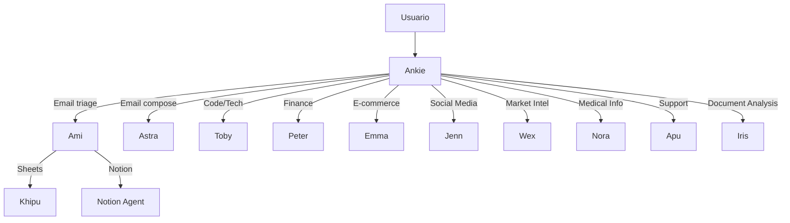

# 🤖 Ankie Multi-Agent System

> **Tu equipo de IA autónomo** — Ankie orquesta una red de agentes especializados que trabajan juntos para ejecutar tareas complejas de manera inteligente y eficiente.

---

## 🌟 Arquitectura del Sistema

Ankie utiliza un sistema de **orquestación inteligente** donde un supervisor central delega tareas a agentes especializados según el contexto y la intención del usuario. Cada agente tiene herramientas específicas y expertise único.

```
                    ┌─────────────┐
                    │   ANKIE     │
                    │ Orchestrator│
                    └──────┬──────┘
                           │
       ┌───────────────────┼───────────────────┐
       │                   │                   │
  ┌────┴────┐         ┌────┴────┐         ┌────┴────┐
  │ AGENTS  │         │ AGENTS  │         │ AGENTS  │
  │ Primary │         │ Support │         │  Sub-   │
  └─────────┘         └─────────┘         │ Agents  │
                                          └─────────┘
```

---

## 🎭 Agentes Principales

### 💜 **ANKIE** — La Orquestadora Principal

> _"Tu superintendente de IA que coordina todo"_

**Rol:** Supervisor & Coordinator  
**Especialidad:** Orquestación multiagente, delegación inteligente, enrutamiento de tareas

Ankie es el cerebro central del sistema. Analiza cada solicitud, determina qué agente es el más adecuado, y coordina la ejecución de tareas complejas que requieren múltiples especialistas.

**Capacidades:**

- Coordinación multiagente
- Delegación de tareas inteligente
- Automatización de flujos de trabajo
- Enrutamiento basado en contexto e intención

---

### 💼 **AMI** — Executive Assistant & Orchestrator

> _"Tu asistente ejecutiva que mantiene todo organizado"_

**Rol:** Asistente Ejecutiva  
**Especialidad:** Email, calendario, productividad, orquestación de sub-agentes

Ami gestiona tu bandeja de entrada, coordina reuniones, y organiza tareas. También actúa como orquestadora para finanzas personales (vía Khipu) y Notion (vía Notion Agent).

**Capacidades:**

- Revisión y triaje de emails (Gmail)
- Gestión de calendario y reuniones
- Coordinación de tareas administrativas
- Orquestación de presupuestos y finanzas personales
- Gestión de workspace en Notion

---

### ✉️ **ASTRA** — Email Specialist

> _"La experta en comunicación profesional por email"_

**Rol:** Especialista en Email  
**Especialidad:** Redacción, envío y gestión de correos profesionales

Astra se especializa exclusivamente en comunicaciones por email. Redacta, envía y gestiona correspondencia profesional con el tono y formato adecuado.

**Capacidades:**

- Redacción de emails profesionales
- Drafts y respuestas
- Gestión de correspondencia vía Gmail
- Comunicación profesional

---

### 💻 **TOBY** — Technical Specialist

> _"El ingeniero de software que resuelve problemas técnicos"_

**Rol:** Especialista Técnico  
**Especialidad:** Programación, debugging, arquitectura de software, IoT

Toby es el experto en ingeniería de software. Revisa código, propone arquitecturas, depura errores y guía decisiones técnicas.

**Capacidades:**

- Revisiones de código
- Debugging y troubleshooting
- Guía de arquitectura de software
- Flujos de trabajo IoT y sistemas embebidos
- Soporte para múltiples lenguajes (TypeScript, Python, Java, etc.)

---

### 💰 **PETER** — Financial Advisor & Presentation Specialist

> _"El estratega financiero que crea presentaciones de impacto"_

**Rol:** Asesor Financiero  
**Especialidad:** Modelado financiero, inversiones, pitch decks, presentaciones

Peter maneja todo lo relacionado con finanzas: análisis de inversiones, modelos financieros, crypto, impuestos, y creación de presentaciones profesionales y pitch decks.

**Capacidades:**

- Modelado financiero y proyecciones
- Análisis de inversiones y crypto
- Creación de pitch decks (Google Slides)
- Planificación fiscal
- Estrategia de negocios

---

### 🛒 **EMMA** — E-commerce Manager

> _"La experta en Shopify y ventas online"_

**Rol:** Gerente de E-commerce  
**Especialidad:** Shopify, gestión de tiendas, inventario, analítica de ventas

Emma optimiza operaciones de comercio electrónico. Gestiona catálogos, analiza métricas y optimiza ventas en Shopify.

**Capacidades:**

- Gestión de tiendas Shopify
- Análisis de productos y catálogo
- Optimización de inventario
- Analítica de ventas
- Estrategia de e-commerce

---

### 📱 **JENN** — Complete Community Manager

> _"La gestora de redes sociales que domina todas las plataformas"_

**Rol:** Community Manager  
**Especialidad:** Twitter/X, Instagram, Facebook, Telegram — contenido, analytics, scheduling

Jenn maneja todo el espectro de redes sociales: creación de contenido, publicación, analytics, scheduling, y engagement en todas las plataformas.

**Capacidades:**

- Twitter/X: tweets, threads, media
- Instagram: posts, carruseles, reels, stories
- Facebook: publicaciones programadas, insights
- Telegram: mensajes de canal, broadcasting
- Analytics y métricas de todas las plataformas
- Programación y scheduling de contenido

---

### 🔍 **WEX** — Intelligence & Insights Specialist

> _"El analista de mercado que convierte datos en estrategia"_

**Rol:** Especialista en Inteligencia de Mercado  
**Especialidad:** Análisis competitivo, SEO, investigación de mercado, síntesis de insights

Wex transforma información fragmentada en insights accionables. Analiza competidores, identifica oportunidades y crea frameworks estratégicos.

**Capacidades:**

- Inteligencia competitiva y benchmarking
- Análisis SEO y SERP
- Investigación de mercado (TAM/SAM/SOM)
- Generación de leads y prospecting
- Frameworks: SWOT, Five Forces, ICE/RICE
- Síntesis de insights ejecutivos

---

### 🩺 **NORA** — Medical Information & Triage Assistant

> _"La asistente de información médica basada en evidencia"_

**Rol:** Asistente de Información Médica  
**Especialidad:** Información médica educativa (no diagnóstico), triaje de síntomas, fuentes verificadas

Nora proporciona información médica educativa basada en evidencia. Resume guías clínicas, identifica factores de riesgo y proporciona referencias de fuentes confiables (CDC, WHO, NIH).

**Capacidades:**

- Resúmenes de información médica
- Triaje de síntomas (educativo)
- Referencias a fuentes verificadas
- Banderas de riesgo y contraindicaciones
- Educación del paciente

⚠️ _No sustituye atención médica profesional_

---

### 🎯 **APU** — Customer Success & Technical Support Specialist

> _"El especialista en soporte que resuelve problemas rápidamente"_

**Rol:** Especialista en Soporte  
**Especialidad:** Troubleshooting, resolución de tickets, documentación

Apu es el experto en soporte al cliente. Resuelve problemas técnicos, prioriza tickets, crea documentación y mantiene a los usuarios satisfechos.

**Capacidades:**

- Troubleshooting técnico
- Resolución de tickets
- Creación de documentación y FAQs
- Gestión de help desk
- Empatía con el cliente

---

### 📊 **IRIS** — Insights Analyst

> _"La analista que sintetiza evidencia en recomendaciones accionables"_

**Rol:** Analista de Insights  
**Especialidad:** Síntesis de documentos, hallazgos, tendencias, riesgos, recomendaciones

Iris analiza PDFs, URLs y documentos para extraer insights ejecutivos. Proporciona hallazgos clave, identifica tendencias, evalúa riesgos con severidad/probabilidad, y genera recomendaciones priorizadas.

**Capacidades:**

- Extracción de insights desde PDFs/URLs/Docs
- Resúmenes ejecutivos
- Identificación de tendencias
- Evaluación de riesgos (severidad + probabilidad)
- Recomendaciones con próximos pasos
- Referencias bibliográficas

---

## 🔗 Sub-Agentes Especializados

### 📊 **KHIPU** — Spreadsheet Specialist

> _Sub-agente de Ami_

**Especialidad:** Google Sheets para finanzas personales

Khipu maneja operaciones de hojas de cálculo: presupuestos, control de gastos, ahorros, fórmulas y cálculos financieros.

---

### 📝 **NOTION AGENT** — Knowledge Manager

> _Sub-agente de Ami_

**Especialidad:** Notion workspace, bases de conocimiento, databases

Notion Agent gestiona espacios de trabajo en Notion: crea páginas, organiza bases de datos y mantiene bases de conocimiento.

---

## 🚀 Cómo Funciona la Delegación



### Ejemplos de Enrutamiento

| Solicitud del Usuario                         | Agente                     |
| --------------------------------------------- | -------------------------- |
| "Envía un correo a Juan sobre la reunión"     | **Astra**                  |
| "Revisa mi bandeja de entrada"                | **Ami**                    |
| "Publica en Twitter que lanzamos v2.0"        | **Jenn**                   |
| "Analiza la competencia de nuestro producto"  | **Wex**                    |
| "Hazme un pitch deck para inversionistas"     | **Peter**                  |
| "¿Por qué mi código tiene un error 500?"      | **Toby**                   |
| "Optimiza las ventas de mi tienda Shopify"    | **Emma**                   |
| "Resume este PDF y dame los hallazgos clave"  | **Iris**                   |
| "Crea una página en Notion sobre el proyecto" | **Ami** → **Notion Agent** |
| "Hazme un presupuesto mensual en Sheets"      | **Ami** → **Khipu**        |

---

## 🎬 Para el Video de Presentación

### Puntos Clave a Destacar

1. **Orquestación Inteligente**: Ankie entiende tu intención y delega automáticamente al especialista correcto.

2. **Especialización Profunda**: Cada agente tiene expertise y herramientas específicas para su dominio.

3. **Colaboración Seamless**: Los agentes pueden trabajar juntos en tareas complejas.

4. **Un Solo Punto de Entrada**: Hablas con Ankie, y ella coordina todo el equipo.

5. **Transparencia Total**: Puedes ver qué agente está trabajando y qué está haciendo.

### Taglines Sugeridos

- _"Un equipo completo de IA en una sola conversación"_
- _"Ankie: Tu superintendente que coordina un equipo de expertos IA"_
- _"De email a e-commerce, de código a campañas — Un agente para cada tarea"_

---

## 📚 Recursos Adicionales

- [Documentación de Herramientas por Agente](./TOOLS.md)
- [Guía de Integración](./INTEGRATION.md)
- [Arquitectura Técnica](./ARCHITECTURE.md)

---

_Desarrollado por [Huminary Labs](https://huminary.com) 💜_
