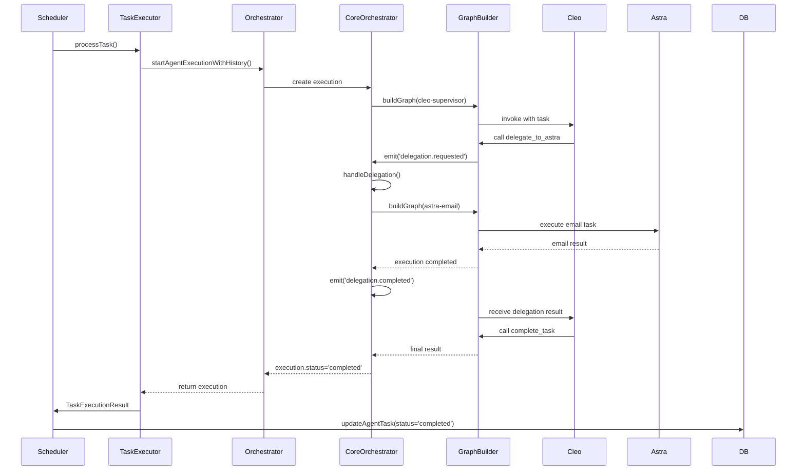

# Fix: Tareas Quedan en Estado "Running" - Sistema de Delegación

## Problema Identificado

Las tareas programadas con delegaciones (especialmente del agente Cleo hacia Astra para envío de emails) quedaban atascadas en estado `running` y nunca completaban.

### Causa Raíz

El `task-executor.ts` usaba directamente `GraphBuilder` con su propio `EventEmitter` aislado, desconectado del `CoreOrchestrator`. Esto causaba:

1. **Delegación iniciada**: `GraphBuilder` emitía `delegation.requested`
2. **Evento perdido**: El `CoreOrchestrator` (que maneja delegaciones) nunca recibía el evento
3. **Delegación nunca ejecutada**: El método `handleDelegation()` nunca se invocaba
4. **Esperando infinitamente**: El grafo esperaba `delegation.completed` que nunca llegaba
5. **Task colgada**: La tarea quedaba en estado `running` hasta que el cleanup la marcaba como fallida después de 10 minutos

### Evidencia de los Logs

```log
2025-10-05T19:50:50.114Z [info] 🔍 [ENHANCED ADAPTER] startAgentExecutionWithHistory OK
2025-10-05T19:52:50.066Z [info] 🔍 [ENHANCED ADAPTER] Legacy result: { legacyStatus: 'running', hasMessages: false }
2025-10-05T19:52:23.113Z [warning] ⚠️ [ContextGuard] Tool 'delegate_to_astra' executed with missing request context
2025-10-05T19:54:20.070Z [warning] ⚠️ [ContextGuard] Tool 'delegate_to_astra' executed...
```

La delegación se repetía porque la primera nunca completaba.

## Solución Implementada

### Cambios en `task-executor.ts`

**Antes (Roto)**:
```typescript
// Creaba GraphBuilder aislado con su propio EventEmitter
const eventEmitter = new EventEmitter();
const graphBuilder = new GraphBuilder({ modelFactory, eventEmitter, executionManager });
const graph = await graphBuilder.buildGraph(agent);
const compiledGraph = graph.compile();
const result = await compiledGraph.invoke(initialState);
```

**Después (Funcionando)**:
```typescript
// Usa el orchestrador completo con CoreOrchestrator integrado
const { getAgentOrchestrator } = await import('@/lib/agents/agent-orchestrator');
const orchestrator = getAgentOrchestrator();

const execution = orchestrator.startAgentExecutionWithHistory(taskPrompt, agent.id, []);

// Poll hasta completar (con timeout)
for (let i = 0; i < maxPolls; i++) {
  await new Promise(resolve => setTimeout(resolve, pollInterval));
  const currentExecution = orchestrator.getExecution(execution.id);
  if (currentExecution.status === 'completed' || currentExecution.status === 'failed') {
    return currentExecution;
  }
}
```

### Por Qué Funciona Ahora

1. **Orchestrador Unificado**: `getAgentOrchestrator()` retorna el legacy orchestrator que internamente usa `CoreOrchestrator`
2. **EventEmitter Compartido**: El `CoreOrchestrator` y `GraphBuilder` comparten el mismo EventEmitter
3. **Listener Activo**: `CoreOrchestrator` tiene un listener para `delegation.requested`:
   ```typescript
   this.eventEmitter.on('delegation.requested', async (delegationData) => {
     await this.handleDelegation(delegationData)
   })
   ```
4. **Delegación Completa**: Cuando `handleDelegation()` termina, emite `delegation.completed`
5. **Grafo Continua**: El `GraphBuilder` recibe el evento y continúa la ejecución
6. **Task Completa**: La tarea finalmente llega a estado `completed` o `failed`

## Flujo Correcto Ahora



## Archivos Modificados

1. **`lib/agent-tasks/task-executor.ts`**
   - Cambiado de usar `GraphBuilder` directamente a usar `getAgentOrchestrator()`
   - Implementado polling para esperar completion
   - Actualizado manejo de resultados para trabajar con `AgentExecution`

## Testing

Para verificar que el fix funciona:

```bash
# 1. Crear una tarea de email programada
POST /api/agent-tasks
{
  "agent_id": "cleo-supervisor",
  "title": "TEST EMAIL DELEGATION",
  "description": "Research Tesla news and send email to test@example.com",
  "task_config": { "recipient": "test@example.com" },
  "task_type": "scheduled"
}

# 2. Verificar que la tarea completa (no queda en running)
GET /api/agent-tasks?status=running  # Debe estar vacío después de unos segundos
GET /api/agent-tasks?status=completed  # Debe mostrar la tarea
```

## Métricas de Éxito

- ✅ Tareas con delegación completan exitosamente
- ✅ Estado `running` dura solo mientras se ejecuta (segundos/minutos, no indefinidamente)
- ✅ Eventos `delegation.completed` se emiten correctamente
- ✅ No se requiere cleanup de tareas stuck
- ✅ Logs muestran flujo completo de delegación

## Prevención Futura

Para evitar este problema en el futuro:

1. **Siempre usar orchestrador completo** para ejecuciones que requieran delegaciones
2. **No crear EventEmitters aislados** - compartir la instancia global
3. **Verificar que los listeners estén registrados** antes de emitir eventos críticos
4. **Agregar timeouts explícitos** para todas las operaciones async
5. **Logging comprehensivo** de eventos de delegación para debugging

## Referencias

- [Orchestrator Architecture](./ORCHESTRATOR-ARCHITECTURE.md)
- [Delegation System](./DELEGATION-SYSTEM.md)
- [Task Timeout Flow](./diagrams/task-timeout-flow.md)
