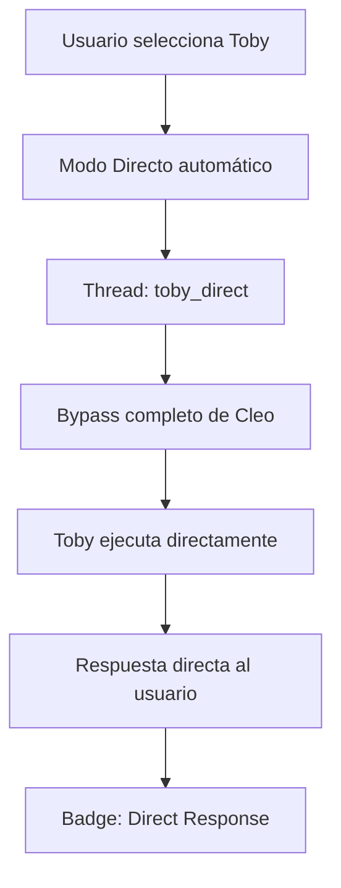
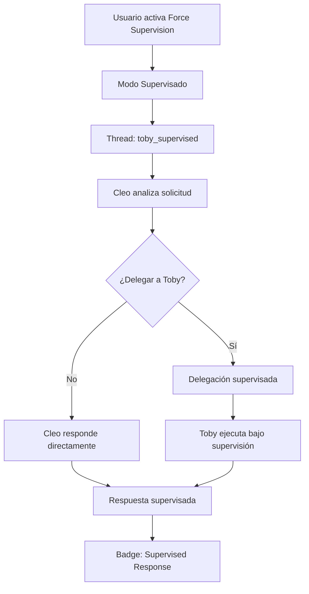

# Cleo Multi-Agent System — Guía Completa del Proyecto (Septiembre 2025)

> Guía integral del **sistema dual-mode revolucionario**: interacción directa con agentes especializados O supervisión inteligente de Cleo, arquitectura modular completa, gestión de contexto segregado y UI intuitiva.

---

## 1) Revolución Dual-Mode: Control Total de Conversación

### 🎮 Sistema de Conversación Intuitivo

Cleo v5.0 introduce un sistema dual-mode que elimina la confusión de contexto y da control total al usuario:

#### 🎯 **Modo Directo** (Por Defecto)
```typescript
// Selección intuitiva: Usuario elige Toby → Interacción directa automática
selectedAgent: 'toby-developer' → conversationMode: 'direct'
```
- **✨ Activación**: Automática al seleccionar agente específico
- **⚡ Velocidad**: Sin overhead de routing supervisor
- **📝 Contexto**: Preservación específica del agente
- **🧵 Thread**: `{agentId}_direct` - completamente segregado

#### 👩‍💼 **Modo Supervisado** (Toggle)
```typescript
// Control manual: Toggle "Force Cleo Supervision" → Supervisión activa
forceSupervised: true → conversationMode: 'supervised'
```
- **🔧 Control**: Toggle manual para activar supervisión
- **🤖 Inteligencia**: Cleo coordina y supervisa interacciones
- **🛡️ Robustez**: Manejo avanzado de errores y recuperación
- **🧵 Thread**: `{agentId}_supervised` - aislado del modo directo

### 📱 Interfaz de Usuario Renovada

#### Indicadores Visuales Claros
- **🟢 Modo Directo**: Badge verde + "Direct Mode" + icono ArrowRight
- **🔵 Modo Supervisado**: Badge azul + "Supervised Mode" + icono Shield/Eye
- **👤 Por Mensaje**: Indicadores de qué agente generó cada respuesta

#### Controles Intuitivos
```tsx
// Header dinámico que aparece al seleccionar agente
<ModeHeader>
  <ModeIndicator mode={currentMode} agent={selectedAgent} />
  <ForceSupervisionToggle onChange={handleModeSwitch} />
  <ModeDescription />
</ModeHeader>
```

### 🧵 Segregación Total de Threads

**Aislamiento Completo:**
- **Direct Threads**: `toby-developer_direct`, `ami-creative_direct`
- **Supervised Threads**: `toby-developer_supervised`, `ami-creative_supervised`
- **Sin Contaminación**: Contextos completamente separados
- **Historial Limpio**: Sin confusión entre modos de conversación

---

## 2) Visión del Sistema Multi-Agente Integrado

Cleo es ahora un sistema multi-agente completamente modular con **revolución dual-mode**:
- **Cleo (Supervisor)**: Coordinador emocional inteligente con supervisión opcional
- **Toby (Técnico)**: Especialista en investigación técnica - interacción directa disponible
- **Ami (Creativo)**: Experto en diseño e innovación - comunicación directa fluida  
- **Peter (Lógico)**: Matemático y optimización - acceso directo para cálculos
- **Emma (E-commerce)**: Especialista en Shopify - interacción directa para consultas comerciales

**Características Revolucionarias v5.0:**
- **🎮 Dual-Mode System**: Directo OR supervisado - elección del usuario
- **🎯 Selección Intuitiva**: Agente específico = modo directo automático
- **🧵 Thread Segregation**: Contexto completamente aislado por modo
- **📊 UI Indicators**: Feedback visual claro del modo activo
- **🏗️ Arquitectura modular completa** con core optimizado
- **🛡️ Delegación inteligente** basada en análisis de tareas
- **🔧 Herramientas especializadas** para cada agente
- **📡 Sistema de eventos** en tiempo real
- **⚠️ Gestión robusta de errores** y recuperación automática

---

## 3) Arquitectura Modular Dual-Mode

### Stack Tecnológico v5.0
- **Framework**: Next.js 15 (App Router) + TypeScript 5.0+
- **Orquestación**: LangChain + LangGraph con **dual-mode orchestrator**
- **Base de Datos**: Supabase (PostgreSQL + pgvector) con RLS
- **Autenticación**: Supabase Auth con aislamiento por usuario
- **Estado**: Zustand + Registry global con **conversation contexts**
- **Contenedores**: Docker con pnpm para desarrollo y producción

### Componentes Core Dual-Mode (`lib/agents/core/`)
```typescript
// Orquestador dual-mode integrado
import { globalOrchestrator } from '@/lib/agents/core'

// Método principal para UI con detección automática de modo
const result = await globalOrchestrator.startAgentExecutionForUI(
  input,
  selectedAgentId,
---

## 4) Flujos de Ejecución Dual-Mode

### 🎯 Flujo Directo (Modo Por Defecto)


**Proceso Directo:**
1. **Detección Automática**: Usuario selecciona agente específico
2. **Thread Segregado**: `{agentId}_direct` creado/recuperado
3. **Ejecución Directa**: Sin overhead de routing supervisor
4. **Respuesta Inmediata**: Agente responde directamente al usuario
5. **Indicador Visual**: Badge verde "Direct Mode" visible

### 👩‍💼 Flujo Supervisado (Toggle Override)


**Proceso Supervisado:**
1. **Activación Manual**: Toggle "Force Cleo Supervision" activado
2. **Thread Segregado**: `{agentId}_supervised` creado/recuperado
3. **Análisis de Cleo**: Evaluación de la solicitud del usuario
4. **Decisión Inteligente**: Delegar vs responder directamente
5. **Ejecución Supervisada**: Con oversight y control de calidad
6. **Síntesis Final**: Cleo revisa antes de presentar al usuario
7. **Indicador Visual**: Badge azul "Supervised Mode" visible

### 🔄 Ejemplos de Uso Práctico

#### Modo Directo - Consultas Específicas
```
Usuario: "Ayúdame con código Python"
→ Selecciona Toby
→ Modo directo automático
→ Toby responde directamente sobre Python
→ Badge verde: "Direct Response from Toby"
```

#### Modo Supervisado - Tareas Complejas
```
Usuario: "Necesito una estrategia completa de marketing"
→ Selecciona Ami + Toggle ON
→ Modo supervisado activo
→ Cleo analiza y puede involucrar a Ami, Peter, Emma
→ Badge azul: "Supervised Response"
```

---

## 5) Agentes Especializados con Capacidad Dual-Mode

### 💝 Cleo - Supervisor con Inteligencia Emocional
**Rol**: Coordinador principal y soporte emocional

**Capacidades Dual-Mode:**
- **Modo Supervisado**: Activación vía toggle, coordinación inteligente
- **Detección emocional**: Sofisticada interpretación de estados del usuario
- **Delegación inteligente**: Análisis de tareas para selección óptima de agente
- **Control de calidad**: Revisión antes de entrega al usuario
- **Interacción empática**: Comunicación personalizada y cálida

**Herramientas**: `getCurrentDateTime`, `weatherInfo`, `randomFact`

### 🔬 Toby - Especialista Técnico con Acceso Directo
**Rol**: Investigación técnica profunda y análisis de datos

**Capacidades Dual-Mode:**
- **Modo Directo**: Comunicación técnica fluida sin intermediarios
- **Modo Supervisado**: Coordinación con otros agentes para análisis complejos
- **Análisis estadístico**: Interpretación avanzada de métricas y datos
- **Investigación técnica**: Documentación y patrones de integración
- **Evaluación de arquitectura**: Sistemas complejos y factibilidad técnica

**Herramientas**: `webSearch`, `calculator`, `getCurrentDateTime`, `cryptoPrices`, `complete_task`

**Metodología de Investigación:**
1. Análisis de alcance → Investigación multi-fuente
2. Procesamiento de datos → Síntesis → Validación
3. Documentación → Finalización con complete_task

### 🎨 Ami - Especialista Creativo con Interacción Directa
**Rol**: Diseño estratégico e innovación creativa

**Capacidades Dual-Mode:**
- **Modo Directo**: Brainstorming y consultas creativas inmediatas
- **Modo Supervisado**: Colaboración multi-agente para proyectos complejos
- **Design thinking**: Procesos centrados en el usuario
- **Estrategia de contenido**: Optimización multi-plataforma
- **Innovación**: Facilitación de talleres y pensamiento lateral

**Herramientas**: `webSearch`, `randomFact`, `createDocument`, `getCurrentDateTime`, `complete_task`

**Metodologías Creativas**: SCAMPER, Design Sprints, Mind Mapping, Frameworks de Storytelling

### 🧮 Peter - Especialista Lógico con Cálculos Directos
**Rol**: Razonamiento sistemático y optimización

**Capacidades Dual-Mode:**
- **Modo Directo**: Cálculos inmediatos y análisis matemático
- **Modo Supervisado**: Modelado complejo con input de otros agentes
- **Cálculos complejos**: Modelado estadístico y optimización
- **Matemáticas financieras**: Análisis de inversiones y ROI
- **Validación**: Técnicas de prueba matemática rigurosa

**Herramientas**: `calculator`, `webSearch`, `getCurrentDateTime`, `cryptoPrices`, `createDocument`, `complete_task`

**Framework de Resolución:**
1. Descomposición → Identificación de restricciones
2. Investigación → Cálculo → Validación → Optimización

### 🛍️ Emma - Especialista E-commerce con Consultas Directas
**Rol**: Inteligencia comercial y optimización de tiendas

**Capacidades Dual-Mode:**
- **Modo Directo**: Consultas Shopify inmediatas y análisis de datos
- **Modo Supervisado**: Estrategias comerciales con input multi-agente
- **Gestión integral**: Tiendas Shopify multi-usuario
- **Análisis predictivo**: Inventario, ventas y comportamiento de clientes
- **Optimización**: Conversiones, marketing y segmentación avanzada

**Herramientas Shopify Completas**: 
- `shopifyGetProducts`, `shopifyGetOrders`, `shopifyGetAnalytics`
- `shopifyGetCustomers`, `shopifySearchProducts`, `shopifyUpdateProductPrice`
- `complete_task`

---

## 6) Sistema de Herramientas Optimizado

### Herramientas por Categoría:
```typescript
// Mapeo optimizado de herramientas por agente
const agentTools = {
  'cleo-supervisor': ['getCurrentDateTime', 'weatherInfo', 'randomFact'],
  'toby-technical': ['webSearch', 'calculator', 'getCurrentDateTime', 'cryptoPrices'],
  'ami-creative': ['webSearch', 'randomFact', 'createDocument', 'getCurrentDateTime'],
  'peter-logical': ['calculator', 'webSearch', 'getCurrentDateTime', 'cryptoPrices', 'createDocument'],
  'emma-ecommerce': ['shopify*', 'complete_task'] // Todas las herramientas Shopify
}
```

### Nueva Herramienta: `complete_task`
```typescript
// Señalización de finalización para especialistas
await complete_task({
  summary: "Análisis técnico completado con recomendaciones",
  status: "completed",
  nextSteps: "Implementar optimizaciones sugeridas"
})
```

---

## 6) Gestión Avanzada de Errores

### Clasificación de Errores:
- **network**: Fallos de conexión y APIs
- **model**: Errores de LLM y límites de tokens
- **validation**: Errores de validación de entrada
- **authentication**: Fallos de autenticación
- **rate_limit**: Límites de API y cuotas
- **timeout**: Timeouts de ejecución
- **graph**: Errores de LangGraph
- **tool**: Fallos de herramientas

### Estrategias de Recuperación:
```typescript
// Recuperación automática con backoff exponencial
const result = await globalErrorHandler.withRetry(
  operation,
  'context',
  { 
    maxAttempts: 5,
    errorTypes: ['network', 'timeout'],
    enableCircuitBreaker: true 
  }
)
```

---

## 7) Observabilidad y Métricas

### Métricas en Tiempo Real:
- **Ejecución**: Duración, tasas de éxito, throughput
- **Agentes**: Rendimiento, eficiencia de delegación
- **Herramientas**: Tiempos de ejecución, patrones de éxito
- **Sistema**: Salud, utilización de recursos, tendencias

### Registro Global:
```typescript
// Registry global para consistencia entre requests
interface GlobalRegistry {
  executions: Map<string, AgentExecution>
  runtimeAgents: Map<string, any>
  metrics: MetricsData
  cleanup: () => void
}
```

---

## 8) Integración de Base de Datos

### Persistencia en Tiempo Real:
- **Ejecuciones**: Todas las ejecuciones persisten con RLS
- **Estado Cruzado**: Registry global mantiene consistencia
- **Limpieza Automática**: Gestión inteligente del ciclo de vida
- **Auditoría**: Historial completo de ejecuciones

### Tablas Principales:
- `agents` - Configuración y estado de agentes
- `executions` - Historial de ejecuciones
- `messages` - Historial de conversaciones
- `metrics` - Métricas de rendimiento
- `user_service_connections` - Credenciales por usuario

---

## 9) Beneficios del Sistema v4.0

### 🚀 **Escalabilidad**
- Arquitectura modular para escalado independiente
- Registry global para gestión eficiente de recursos
- Compatibilidad completa con sistemas legacy

### 🔧 **Mantenibilidad**
- Separación clara de responsabilidades
- Manejo integral de errores y recuperación
- Logging detallado y observabilidad completa

### ⚡ **Rendimiento**
- Rutas de ejecución optimizadas
- Caché inteligente y reutilización de recursos
- Monitoreo en tiempo real y detección de cuellos de botella

### 🛡️ **Robustez**
- Manejo avanzado de errores con múltiples estrategias de recuperación
- Diseño tolerante a fallos con degradación elegante
- Validación integral y gestión de estado

---

## 10) Ejemplos de Uso Completos

### Consulta Técnica Avanzada:
```
Usuario: "Analiza el rendimiento de mi API y dame recomendaciones de optimización"

Flujo:
1. Cleo detecta "análisis" y "rendimiento" → Delega a Toby
2. Toby usa webSearch para investigar mejores prácticas
3. Toby usa calculator para análisis de métricas
4. Toby documenta hallazgos y llama complete_task
5. Cleo presenta síntesis final al usuario
```

### Proyecto Creativo Estratégico:
```
Usuario: "Necesito una campaña de marketing para el lanzamiento de mi producto"

Flujo:
1. Cleo identifica "campaña" y "marketing" → Delega a Ami
2. Ami investiga tendencias con webSearch
3. Ami genera conceptos creativos usando randomFact para inspiración
4. Ami crea documento de campaña con createDocument
5. Ami finaliza con complete_task, Cleo presenta resultado
```

### Análisis Financiero Complejo:
```
Usuario: "Calcula el punto de equilibrio y proyección de ROI para mi nuevo negocio"

Flujo:
1. Cleo detecta "calcular" y "ROI" → Delega a Peter
2. Peter usa calculator para cálculos financieros complejos
3. Peter investiga modelos con webSearch
4. Peter documenta análisis completo con createDocument
5. Peter llama complete_task, Cleo entrega análisis final
```

---

## 11) Delegación y Sub‑Agentes (Ejecución Real)

Esta versión integra delegación real entre agentes y sus sub‑agentes, alineada con patrones de LangGraph (herramientas de handoff + supervisor opcional):

- Registro dinámico de herramientas de delegación: al crear un sub‑agente, se registra en runtime una tool con nombre `delegate_to_{subAgentId}`. Implementación: ver `ensureDelegationToolForAgent` en `lib/tools/index.ts`.
- Exposición automática en API: el endpoint `GET /api/agents` agrega al agente padre las herramientas `delegate_to_*` de todos sus sub‑agentes activos e incluye `delegationToolName` en cada sub‑agente.
- Detección de handoff en el grafo: cuando un agente llama la tool de delegación, el GraphBuilder detecta `{ status: 'delegated', nextAction: 'handoff_to_agent', agentId: ... }` y emite el evento de delegación.
- Orquestación con ejecución real: el Orchestrator resuelve el `agentId` destino, construye su `AgentConfig` y ejecuta el sub‑agente realmente (no simulado). El resultado se incorpora al hilo y se propaga de regreso al agente fuente.
- Modo dual compatible: la delegación funciona tanto en modo directo (padre → sub‑agente) como bajo supervisión (Cleo → agente → sub‑agente → agente → Cleo).

Resumen de flujo real:
1) Agente padre ejecuta `delegate_to_{subAgentId}` → 2) Graph detecta handoff → 3) Orchestrator ejecuta sub‑agente → 4) Sub‑agente resuelve y finaliza → 5) Resultado vuelve al agente padre → 6) Respuesta final al usuario (o a Cleo si hay supervisión).

### Cómo un agente “sabe” que puede delegar
- Si un agente tiene sub‑agentes activos, su lista de herramientas incluirá entradas `delegate_to_*` (inyectadas por la API y registradas en runtime).
- Cada sub‑agente expone `delegationToolName` para trazabilidad y UI.
- Los prompts de agentes recomiendan delegar tareas que mejor resuelva un sub‑especialista.

---

## 12) Pruebas Rápidas (UI y REST)

### UI (modo directo o supervisado)
1) Crea o verifica un sub‑agente para un agente padre (desde el panel de agentes).
2) Abre chat con el agente padre (p. ej., Toby). Activa o no el toggle “Force Cleo Supervision” según quieras probar directo o supervisado.
3) Envía una instrucción que sugiera delegación, por ejemplo: “Usa tu sub‑agente de análisis para revisar esta tabla y dame hallazgos”.
4) Espera ver un mensaje de handoff y luego la respuesta del sub‑agente integrada en la conversación.

Sugerencia: Para forzar la ruta, indica explícitamente “usa la herramienta delegate_to_{SUB_AGENT_ID} con la tarea X…”.

### REST (POST /api/agents/execute)
Ejemplo mínimo para ejecutar con un agente padre y disparar delegación:

```bash
curl -X POST \
  -H "Content-Type: application/json" \
  -d '{
    "agentId": "toby-technical",
    "input": "Usa la herramienta delegate_to_SUBID con la tarea: analiza esta lista de métricas y resume hallazgos",
    "forceSupervised": false
  }' \
  http://localhost:3000/api/agents/execute
```

Respuesta esperada (resumen):
- Paso de handoff detectado → ejecución del sub‑agente → respuesta agregada al hilo → mensaje final al usuario.

Verificación adicional:
- `GET /api/agents` debe mostrar en el agente padre las tools `delegate_to_*` y cada sub‑agente con su `delegationToolName`.


### Optimización E-commerce:
```
Usuario: "Analiza mis ventas de Shopify y sugiere mejoras para aumentar conversiones"

Flujo:
1. Cleo identifica "Shopify" y "ventas" → Delega a Emma
2. Emma usa shopifyGetAnalytics para datos históricos
3. Emma analiza productos con shopifyGetProducts
4. Emma examina patrones de clientes con shopifyGetCustomers
5. Emma llama complete_task con recomendaciones, Cleo presenta síntesis
```

---

*Última Actualización: Septiembre 2025 - Sistema Multi-Agente v4.0*
