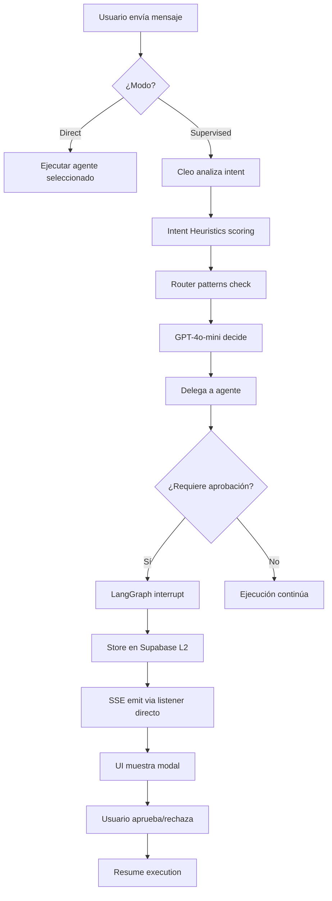

# Sistema de Delegación y Arquitectura Dual-Mode

**Fecha**: Octubre 2025 | **Versión**: 5.0

## Arquitectura Dual-Mode

Cleo implementa **dos modos de ejecución intencionales** para dar control al usuario:

### 1. **Direct Mode** (`direct`)
- Usuario selecciona agente específico en UI → ejecución directa
- Bypassa a Cleo supervisor
- Thread ID: `{agentId}_direct`
- **Caso de uso**: Usuario confía en su elección de agente

### 2. **Supervised Mode** (`supervised`)
- Chat global → Cleo analiza → delega al agente apropiado
- Orquestación inteligente con coordinación entre agentes
- Thread ID: `cleo-supervisor_supervised`
- **Caso de uso**: Usuario quiere recomendación de IA

---

## Pipeline de Delegación (3 Capas)

El sistema usa **refinamiento progresivo** para decidir delegación:

```
┌─────────────────────────────────────────────────┐
│ CAPA 1: Intent Heuristics                      │
│ • Keyword scoring (lib/delegation/intent-       │
│   heuristics.ts)                                │
│ • Score 0-1 basado en keywords por agente       │
│ • Ejemplo: "enviar correo" → AMI (0.9)          │
└─────────────────────────────────────────────────┘
              ↓
┌─────────────────────────────────────────────────┐
│ CAPA 2: Router (Early-Exit Patterns)           │
│ • Patrones explícitos (lib/agents/router/)      │
│ • EMAIL_COMPOSE_KEYWORDS → ASTRA                │
│ • Overrides heuristics si match exacto          │
└─────────────────────────────────────────────────┘
              ↓
┌─────────────────────────────────────────────────┐
│ CAPA 3: Model Decision (GPT-4o-mini)            │
│ • Recibe System Prompt Hint si score >= 0.55    │
│ • MODELO TIENE ÚLTIMA PALABRA                   │
│ • Puede ignorar sugerencias si razona distinto  │
└─────────────────────────────────────────────────┘
```

**Principio clave**: Las capas 1-2 **sugieren**, el modelo **decide**. Esto permite razonamiento contextual vs reglas rígidas.

---

## Propagación de Interrupts (HITL)

### Problema Original
- Supervised mode: Cleo → Agent (parent/child hierarchy) → propagación funcionaba ✅
- Direct mode: Solo Agent (sin parent) → propagación fallaba ❌

### Solución Implementada
**Direct Event Listener** en `app/api/chat/route.ts`:
```typescript
orchestrator.eventEmitter.on('execution.interrupted', (data) => {
  send({ type: 'interrupt', interrupt: {...} })
})
```

**Ventaja**: No depende de jerarquía parent/child → funciona en **ambos modos**.

---

## Persistencia de Interrupts

**Problema**: Serverless recycling (Vercel) pierde memoria en-proceso durante aprobaciones (10-300s).

**Solución**: Dual-layer persistence
- **L1 Cache**: In-memory Map (rápido)
- **L2 Storage**: Supabase `agent_interrupts` table (durable)
- **Timeout dinámico**: Pausa durante `approvalState.isWaiting = true`

---

## Flujo de Decisión



---

## Referencias

- Dual-mode: `docs/dual-mode-agent-system.md`
- Intent scoring: `lib/delegation/intent-heuristics.ts`
- Router: `lib/agents/router/index.ts`
- Interrupts: `lib/agents/core/interrupt-manager.ts`
