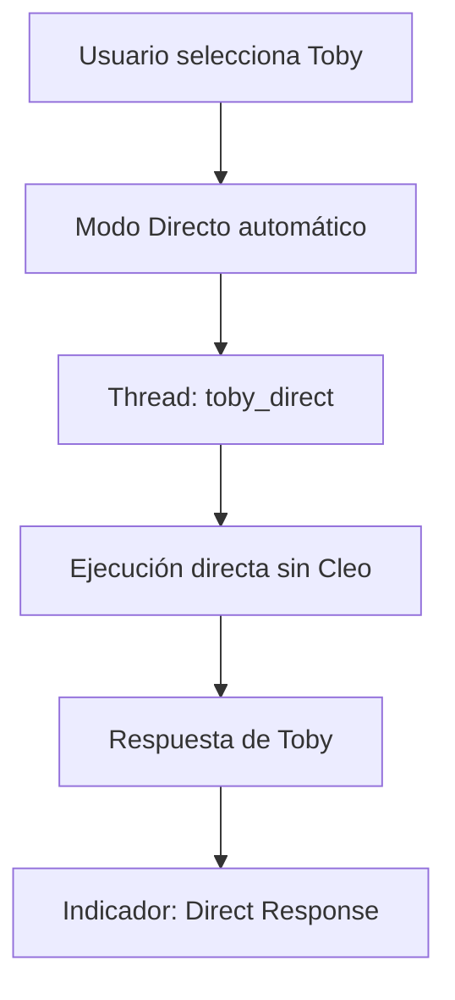
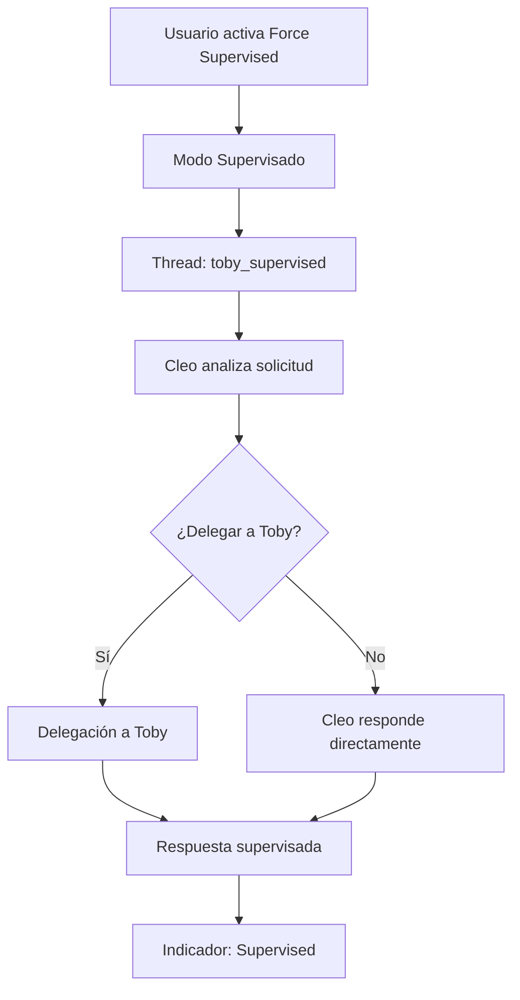

# Sistema Dual-Mode de Agentes - Guía Completa

> **Actualizado**: Septiembre 4, 2025  
> **Versión**: 5.0 - Sistema Dual-Mode Implementado

## 🎯 Visión General

El Sistema Dual-Mode de Cleo permite a los usuarios elegir entre **interacción directa** con agentes específicos o **supervisión inteligente** de Cleo, eliminando la confusión de contexto y proporcionando control total sobre el flujo de conversación.

### ⭐ Características Principales

- **🎮 Interacción Intuitiva**: Seleccionar agente = interacción directa automática
- **👩‍💼 Supervisión Opcional**: Toggle para activar supervisión de Cleo cuando se necesite
- **🧵 Threads Segregados**: Historial completamente separado por modo de conversación
- **📊 Indicadores Visuales**: Claridad visual del modo activo en todo momento
- **🔄 Context Preservation**: Preservación completa de contexto por modo

---

## 🏗️ Arquitectura del Sistema

### Modos de Conversación

#### 🎯 **Modo Directo** (`direct`)
```typescript
// Usuario selecciona agente específico → Modo directo automático
selectedAgent: 'toby-developer' → mode: 'direct'
```

**Características**:
- Bypass completo de Cleo
- Ejecución directa del agente seleccionado
- Sin overhead de routing supervisor
- Preservación de contexto del agente específico
- Thread segregado: `agentId_direct`

#### 👩‍💼 **Modo Supervisado** (`supervised`)
```typescript
// Usuario activa "Force Cleo Supervision" → Modo supervisado
forceSupervised: true → mode: 'supervised'
```

**Características**:
- Cleo supervisa y coordina todas las interacciones
- Delegación automática basada en análisis de tareas
- Manejo robusto de errores con reintentos
- Coordinación entre múltiples agentes
- Thread segregado: `agentId_supervised`

### 🎨 Componentes de UI

#### Header Dinámico con Controles
```tsx
// Aparece cuando se selecciona un agente
<ModeHeader>
  <ModeIndicator mode={currentMode} />
  <ForceSupervisionToggle />
  <ModeDescription />
</ModeHeader>
```

#### Indicadores Visuales
- **Verde + ArrowRight**: Modo Directo activo
- **Azul + Shield/Eye**: Modo Supervisado activo
- **Badges por Mensaje**: Modo de generación de cada respuesta

---

## 🔧 Implementación Técnica

### Tipos Core

```typescript
// Tipos principales del sistema dual-mode
export type ConversationMode = 'direct' | 'supervised'

export interface ConversationContext {
  mode: ConversationMode
  targetAgentId?: string // Para modo directo
  supervisorAgentId?: string // Para modo supervisado
  userPreferences: {
    allowDelegation: boolean
    requireExplicitApproval: boolean
    defaultMode: ConversationMode
  }
  metadata: {
    threadId: string
    sessionId: string
    userId: string
    createdAt: Date
    lastUpdated: Date
  }
}
```

### Orquestador Dual-Mode

```typescript
// Método principal para UI
startAgentExecutionForUI(
  input: string,
  selectedAgentId?: string,
  threadId?: string,
  userId?: string,
  priorMessages: Array<MessageContext> = [],
  forceSupervised: boolean = false
): AgentExecution

// Lógica de determinación de modo
private determineConversationMode(agentId?: string): {
  mode: ConversationMode
  targetAgentId?: string
} {
  // Regla intuitiva: Agente específico = Modo directo
  if (agentId && agentId !== 'cleo-supervisor') {
    return { mode: 'direct', targetAgentId: agentId }
  }
  return { mode: 'supervised' }
}
```

### Router Inteligente

```typescript
// Router con detección de modo de conversación
graphBuilder.addConditionalEdges('router', async (state) => {
  const conversationMode = additionalKwargs.conversation_mode
  const targetAgentId = additionalKwargs.target_agent_id
  
  // Routing directo para modo direct
  if (conversationMode === 'direct' && targetAgentId) {
    return targetAgentId
  }
  
  // Routing supervisado con análisis de contenido
  return supervisedRoutingLogic(state)
})
```

---

## 🎮 Guía de Uso

### Para Usuarios

#### 🎯 Interacción Directa (Modo por Defecto)
1. **Seleccionar agente específico** (Toby, Ami, Peter, Emma)
2. **Automáticamente activa modo directo**
3. **Indicador verde** "Direct Mode" aparece
4. **Conversación directa** sin intervención de Cleo

```
Usuario: "Ayúdame con código Python"
→ Selecciona Toby
→ Modo Directo automático
→ Toby responde directamente
```

#### 👩‍💼 Supervisión Activada (Toggle Override)
1. **Activar toggle** "Force Cleo Supervision"
2. **Indicador azul** "Supervised Mode" aparece
3. **Cleo supervisa** todas las interacciones
4. **Delegación automática** cuando sea apropiado

```
Usuario: "Ayúdame con código Python"
→ Selecciona Toby + Toggle ON
→ Modo Supervisado activo
→ Cleo supervisa y puede delegar a Toby
```

### Para Desarrolladores

#### Integración API
```typescript
// Client Store - Ejecutar con modo
await executeAgent(
  input,
  selectedAgentId,
  forceSupervised  // true = supervisado, false = automático
)

// API Route - Soporte dual-mode
POST /api/agents/execute
{
  "input": "mensaje del usuario",
  "agentId": "toby-developer",
  "forceSupervised": false,
  "threadId": "thread_uuid"
}
```

#### Thread Management
```typescript
// Thread keys segregados por modo
const threadKey = `${agentId}_${mode}`
// Ejemplos:
// "toby-developer_direct"
// "toby-developer_supervised"

// Títulos descriptivos
const title = mode === 'direct' 
  ? `${agentName} (Direct Chat)`
  : `${agentName} (Supervised by Cleo)`
```

---

## 🔄 Flujos de Ejecución

### Flujo Directo


### Flujo Supervisado


---

## 📊 Beneficios del Sistema

### Para Usuarios
- **🎯 Intuitividad**: Selección natural = interacción directa
- **🔧 Control**: Toggle para supervisión cuando se necesite
- **📝 Claridad**: Siempre saben qué modo está activo
- **💾 Contexto**: Historial segregado evita confusión
- **⚡ Performance**: Modo directo más rápido

### Para el Sistema
- **🧵 Aislamiento**: Threads completamente separados
- **🛡️ Robustez**: Manejo de errores en ambos modos
- **📈 Escalabilidad**: Arquitectura preparada para expansión
- **🔧 Mantenibilidad**: Código claro y estructurado
- **📊 Observabilidad**: Métricas detalladas por modo

---

## 🎯 Casos de Uso

### Modo Directo - Ideal Para:
- **Consultas específicas** a un agente especializado
- **Conversaciones enfocadas** en un tema específico
- **Interacciones rápidas** sin necesidad de coordinación
- **Testing y debugging** de agentes individuales

### Modo Supervisado - Ideal Para:
- **Tareas complejas** que requieren coordinación
- **Análisis multi-perspectiva** de varios agentes
- **Usuarios nuevos** que no conocen las especialidades
- **Situaciones ambiguas** donde Cleo puede guiar mejor

---

## 🔧 Configuración y Personalización

### Preferencias de Usuario
```typescript
interface UserPreferences {
  defaultMode: ConversationMode // 'direct' | 'supervised'
  allowDelegation: boolean
  requireExplicitApproval: boolean
  showModeIndicators: boolean
}
```

### Configuración de Agentes
```typescript
interface AgentConfig {
  // ... configuración existente
  supportedModes: ConversationMode[] // Modos soportados
  directModeCapabilities: string[] // Capacidades en modo directo
  supervisedIntegration: boolean // Integración con supervisión
}
```

---

## 📈 Métricas y Monitoreo

### Métricas por Modo
- **Execution Time**: Tiempo promedio por modo
- **Success Rate**: Tasa de éxito por modo  
- **User Preference**: Distribución de uso de modos
- **Error Rate**: Errores por modo y agente
- **Context Switches**: Cambios entre modos

### Eventos de Sistema
```typescript
interface ModeEvent {
  type: 'mode_switch' | 'direct_execution' | 'supervised_delegation'
  fromMode?: ConversationMode
  toMode: ConversationMode
  agentId: string
  userId: string
  timestamp: Date
  metadata: Record<string, any>
}
```

---

## 🚀 Evolución Futura

### Roadmap
- **🤖 Auto-Mode Detection**: IA para sugerir modo óptimo
- **👥 Multi-Agent Direct**: Modo directo con múltiples agentes
- **📊 Advanced Analytics**: Dashboards de uso por modo
- **🔧 Custom Workflows**: Flujos personalizados por usuario
- **🌐 API Extensions**: APIs públicas para integraciones

### Extensibilidad
El sistema está diseñado para extensión fácil:
- Nuevos modos de conversación
- Agentes adicionales con soporte dual-mode
- Integraciones con sistemas externos
- Personalización avanzada de UI

---

## 💡 Mejores Prácticas

### Para Usuarios
1. **Usar modo directo** para consultas específicas
2. **Activar supervisión** para tareas complejas
3. **Revisar indicadores** para confirmar modo activo
4. **Aprovechar threads segregados** para contexto claro

### Para Desarrolladores
1. **Preservar context** en transitions entre modos
2. **Implementar fallbacks** para errores de modo
3. **Monitorear métricas** de performance por modo
4. **Testear ambos flujos** en nuevas features

---

*Este documento será actualizado conforme evolucione el sistema dual-mode.*
