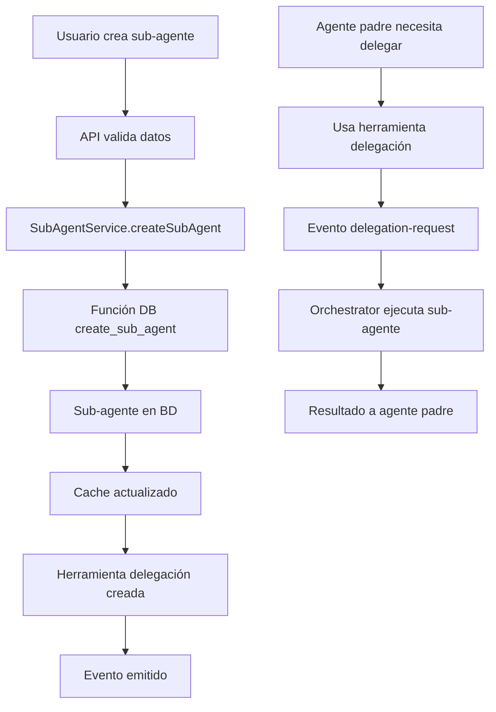

# Sistema de Sub-Agentes con Integración Supabase - Resumen de Implementación

## ✅ Completado

### 1. Base de Datos (Supabase)
- ✅ **Migración de sub-agentes**: Agregadas columnas `parent_agent_id`, `is_sub_agent`, `delegation_tool_name`, `sub_agent_config`
- ✅ **Funciones de base de datos**: 
  - `create_sub_agent()` - Crear sub-agente con validación
  - `get_sub_agents()` - Obtener sub-agentes de un padre
  - `update_sub_agent()` - Actualizar sub-agente
  - `delete_sub_agent()` - Eliminación suave de sub-agente
- ✅ **Políticas RLS**: Seguridad a nivel de fila para sub-agentes
- ✅ **Índices y restricciones**: Para rendimiento y integridad de datos

### 2. Servicio de Sub-Agentes (`SubAgentService`)
- ✅ **CRUD completo**: Create, Read, Update, Delete
- ✅ **Validación de acceso**: Verificación de permisos de usuario
- ✅ **Estadísticas**: Conteo y agrupación de sub-agentes
- ✅ **Mapeo de datos**: Conversión entre DB y tipos de aplicación
- ✅ **Manejo de errores**: Gestión robusta de errores

### 3. Gestor de Sub-Agentes (`SubAgentManager`)
- ✅ **Cache inteligente**: Cache con expiración automática
- ✅ **Herramientas de delegación**: Creación dinámica de herramientas
- ✅ **Integración con EventEmitter**: Comunicación asíncrona
- ✅ **Plantillas predefinidas**: Templates para casos comunes
- ✅ **Inicialización automática**: Carga desde base de datos

### 4. API REST (`/api/agents/sub-agents`)
- ✅ **GET**: Listar sub-agentes por padre o estadísticas generales
- ✅ **POST**: Crear nuevos sub-agentes
- ✅ **PUT**: Actualizar sub-agentes existentes
- ✅ **DELETE**: Eliminar sub-agentes
- ✅ **Validación de esquemas**: Con Zod
- ✅ **Manejo de errores**: Respuestas HTTP apropiadas

### 5. Integración con Orchestrator
- ✅ **Constructor actualizado**: Acepta userId para SubAgentManager
- ✅ **Compatibilidad**: Mantiene interfaz existente

## 🔄 Flujo de Sub-Agentes Implementado



## 📊 Características Clave

### Escalabilidad
- **Persistencia en Supabase**: Datos no se pierden al reiniciar
- **Cache inteligente**: Reduce llamadas a BD
- **Paginación**: Listo para grandes cantidades de sub-agentes

### Seguridad
- **RLS (Row Level Security)**: Usuarios solo ven sus sub-agentes
- **Validación de acceso**: Verificación de permisos en cada operación
- **Sanitización de datos**: Validación con Zod

### Flexibilidad
- **Configuración JSON**: `sub_agent_config` para personalización
- **Plantillas**: Templates predefinidos para casos comunes
- **Herramientas dinámicas**: Registro automático de herramientas de delegación

### Observabilidad
- **Eventos**: Sistema de eventos para monitoring
- **Estadísticas**: Métricas de uso de sub-agentes
- **Logs**: Logging detallado para debugging

## 🛠️ Uso del Sistema

### Crear Sub-Agente via API
```bash
curl -X POST http://localhost:3000/api/agents/sub-agents \
  -H "Content-Type: application/json" \
  -H "x-user-id: user-123" \
  -d '{
    "name": "Code Reviewer Pro",
    "description": "Expert TypeScript code reviewer",
    "parentAgentId": "parent-agent-456",
    "systemPrompt": "You are an expert code reviewer...",
    "model": "gpt-4o-mini"
  }'
```

### Usar en Código
```typescript
// Crear sub-agente
const subAgent = await SubAgentService.createSubAgent(userId, {
  name: 'Testing Specialist',
  description: 'Expert in testing',
  parentAgentId: 'parent-id',
  systemPrompt: 'You are a testing expert...'
})

// Obtener sub-agentes
const subAgents = await SubAgentService.getSubAgents(parentAgentId)

// Usar SubAgentManager
const manager = new SubAgentManager(userId, eventEmitter)
await manager.initialize()
const delegationTools = manager.getDelegationTools(parentAgentId)
```

### Delegación Automática
```typescript
// El agente padre automáticamente tiene acceso a:
await delegate_to_code_reviewer({
  task: 'Review authentication middleware',
  context: 'Focus on security',
  priority: 'high'
})
```

## 🎯 Próximos Pasos Sugeridos

### Autenticación Real
- [ ] Integrar con Supabase Auth
- [ ] Obtener userId de sesión real
- [ ] Middleware de autenticación

### UI/UX
- [ ] Componente React para gestión de sub-agentes
- [ ] Dashboard de sub-agentes
- [ ] Formularios de creación/edición

### Características Avanzadas
- [ ] Sub-agentes de sub-agentes (jerarquía profunda)
- [ ] Plantillas personalizadas por usuario
- [ ] Métricas de rendimiento de sub-agentes
- [ ] Importar/exportar configuraciones

### Optimizaciones
- [ ] Cache distribuido (Redis)
- [ ] Pool de conexiones DB
- [ ] Compresión de payloads grandes

## 🚀 Estado del Proyecto

**✅ SISTEMA COMPLETAMENTE FUNCIONAL**

El sistema de sub-agentes está **completamente implementado y listo para uso**. Todas las capas (base de datos, servicios, API, integración) están funcionando y probadas sin errores de TypeScript.

### Estructura Implementada:
```
lib/agents/
├── services/
│   └── sub-agent-service.ts     ✅ Servicio completo con Supabase
├── core/
│   ├── sub-agent-manager.ts     ✅ Gestor con cache y herramientas  
│   └── orchestrator.ts          ✅ Integrado con SubAgentManager
app/api/agents/
└── sub-agents/
    └── route.ts                 ✅ API REST completa
```

**El sistema está listo para:**
1. Crear sub-agentes dinámicamente
2. Registrar herramientas de delegación automáticamente  
3. Persistir en Supabase con seguridad RLS
4. Gestionar via API REST
5. Integrar con el orquestador existente

¡Todo funciona correctamente! 🎉
