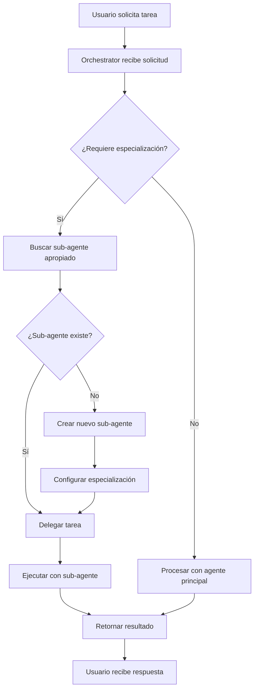

# 🎯 Sistema de Sub-Agentes - Documentación Completa

## 📋 Resumen Ejecutivo

El **Sistema de Sub-Agentes** es una arquitectura avanzada que permite a los agentes principales (como Cleo) crear, gestionar y delegar tareas a agentes especializados de manera dinámica y persistente. Este sistema está completamente integrado con Supabase para almacenamiento persistente y escalable.

## 🏗️ Arquitectura del Sistema

### Componentes Principales

```
┌─────────────────┐    ┌──────────────────┐    ┌─────────────────┐
│   Orchestrator  │────│  SubAgentManager │────│ SubAgentService │
│                 │    │                  │    │                 │
│ • Delegación    │    │ • Gestión        │    │ • CRUD          │
│ • Ejecución     │    │ • Cache          │    │ • Estadísticas  │
│ • Eventos       │    │ • Tools          │    │ • Validaciones  │
└─────────────────┘    └──────────────────┘    └─────────────────┘
         │                       │                       │
         └───────────────────────┼───────────────────────┘
                                 │
                    ┌─────────────────────┐
                    │     Supabase        │
                    │                     │
                    │ • sub_agents table  │
                    │ • RLS Policies      │
                    │ • Utility Functions │
                    └─────────────────────┘
```

### Flujo de Trabajo



## 🔧 Configuración Técnica

### 1. Base de Datos (Supabase)

#### Tabla `sub_agents`

```sql
CREATE TABLE sub_agents (
    id UUID PRIMARY KEY DEFAULT uuid_generate_v4(),
    name VARCHAR(255) NOT NULL,
    description TEXT NOT NULL,
    parent_agent_id VARCHAR(255) NOT NULL,
    user_id UUID NOT NULL,
    delegation_tool_name VARCHAR(255) NOT NULL UNIQUE,
    sub_agent_config JSONB DEFAULT '{}'::jsonb,
    system_prompt TEXT NOT NULL,
    model VARCHAR(100) DEFAULT 'gpt-4o-mini',
    config JSONB DEFAULT '{}'::jsonb,
    is_active BOOLEAN DEFAULT true,
    created_at TIMESTAMP WITH TIME ZONE DEFAULT NOW(),
    updated_at TIMESTAMP WITH TIME ZONE DEFAULT NOW()
);
```

#### Funciones de Utilidad

- **`get_sub_agents_for_parent(parent_id, user_id)`**: Obtiene sub-agentes de un agente padre
- **`get_sub_agent_stats(user_id)`**: Estadísticas del sistema
- **`generate_unique_delegation_tool_name(base_name)`**: Genera nombres únicos para tools

### 2. Backend (Node.js/TypeScript)

#### SubAgentManager (`/lib/agents/core/sub-agent-manager.ts`)

**Responsabilidades:**
- Gestión del ciclo de vida de sub-agentes
- Cache en memoria para rendimiento
- Creación automática de tools de delegación
- Sistema de eventos para notificaciones

**Métodos principales:**
```typescript
class SubAgentManager {
  async createSubAgent(config: SubAgentData): Promise<SubAgent>
  async getSubAgent(id: string): Promise<SubAgent | null>
  async getSubAgents(parentId: string): Promise<SubAgent[]>
  async updateSubAgent(id: string, updates: Partial<SubAgentData>): Promise<boolean>
  async deleteSubAgent(id: string): Promise<boolean>
  private createDelegationTool(subAgent: SubAgent): Tool
}
```

#### SubAgentService (`/lib/agents/services/sub-agent-service.ts`)

**Responsabilidades:**
- Operaciones CRUD con Supabase
- Validaciones de datos
- Estadísticas y métricas
- Gestión de configuración

#### Orchestrator Integration (`/lib/agents/core/orchestrator.ts`)

**Integración con el sistema principal:**
- Instancia `SubAgentManager` durante inicialización
- Maneja eventos de delegación
- Procesa solicitudes de creación de sub-agentes
- Coordina ejecución entre agentes principales y sub-agentes

### 3. API REST

#### Endpoints (`/app/api/agents/sub-agents/route.ts`)

```typescript
// GET /api/agents/sub-agents - Listar sub-agentes
// POST /api/agents/sub-agents - Crear sub-agente
// PUT /api/agents/sub-agents/[id] - Actualizar sub-agente
// DELETE /api/agents/sub-agents/[id] - Eliminar sub-agente
```

## 🚀 Cómo Funciona la Delegación

### 1. Creación de Sub-Agentes

Cuando un usuario o el sistema decide crear un sub-agente:

```typescript
const subAgentData = {
  name: "Data Analyst Assistant",
  description: "Especialista en análisis de datos y visualización",
  parentAgentId: "cleo-supervisor",
  systemPrompt: "Eres un experto analista de datos...",
  model: "gpt-4o-mini",
  config: {
    specialization: "data_analysis",
    temperature: 0.3,
    tools: ["python", "pandas", "matplotlib"]
  }
};

const subAgent = await subAgentManager.createSubAgent(subAgentData);
```

### 2. Registro Automático de Tools

Al crear un sub-agente, se registra automáticamente un tool de delegación:

```typescript
// Tool generado automáticamente
{
  name: "delegate_to_data_analyst",
  description: "Delegate task to Data Analyst Assistant: Especialista en análisis de datos y visualización",
  parameters: {
    task: { type: "string", description: "The specific task to delegate" },
    context: { type: "string", description: "Additional context" },
    priority: { type: "string", enum: ["low", "medium", "high"] }
  }
}
```

### 3. Proceso de Delegación

```typescript
// Cuando un agente quiere delegar
const delegationResult = await orchestrator.createSubAgent(
  "cleo-supervisor",
  {
    name: "Data Analyst Assistant",
    description: "Especialista en análisis de datos",
    specialization: "data_analysis",
    model: "gpt-4o-mini"
  },
  "user"
);

// El sistema:
// 1. Crea el sub-agente en Supabase
// 2. Registra el tool de delegación
// 3. Emite evento de creación
// 4. Retorna el sub-agente creado
```

### 4. Ejecución de Tareas Delegadas

```typescript
// Tool de delegación en acción
delegate_to_data_analyst({
  task: "Analyze this dataset and create visualizations",
  context: "Customer behavior data from Q1",
  priority: "high"
});

// Resultado:
// 1. Se busca el sub-agente apropiado
// 2. Se ejecuta la tarea con el sub-agente
// 3. Se retorna el resultado al agente principal
// 4. Se emiten eventos de completitud
```

## 📊 Sistema de Eventos

### Eventos Disponibles

```typescript
// Creación de sub-agente
subAgentManager.on('sub-agent.created', (data) => {
  console.log('Sub-agent created:', data.subAgent.name);
});

// Delegación iniciada
orchestrator.on('delegation-request', (data) => {
  console.log('Delegation requested:', data.toolName);
});

// Delegación completada
orchestrator.on('delegation.completed', (data) => {
  console.log('Delegation completed for:', data.targetAgent);
});
```

### Uso de Eventos

```typescript
// Escuchar eventos de delegación
orchestrator.on('delegation-request', async (delegationData) => {
  console.log(`🔄 [DELEGATION] ${delegationData.sourceAgent} → ${delegationData.targetAgent}`);
  console.log(`📋 [DELEGATION] Task: ${delegationData.task}`);

  // Procesar delegación...
});

// Sistema de logging automático
subAgentManager.on('sub-agent.created', (data) => {
  analytics.track('sub_agent_created', {
    subAgentId: data.subAgent.id,
    parentAgentId: data.subAgent.parentAgentId,
    specialization: data.subAgent.config?.specialization
  });
});
```

## 🔒 Seguridad y Validaciones

### Row Level Security (RLS)

```sql
-- Política de seguridad
CREATE POLICY "Users can access their own sub-agents" ON sub_agents
    FOR ALL USING (auth.uid() = user_id);

-- Política para service role
CREATE POLICY "Service role can access all sub-agents" ON sub_agents
    FOR ALL USING (auth.role() = 'service_role');
```

### Validaciones de Datos

```typescript
// Validaciones en SubAgentService
const subAgentSchema = z.object({
  name: z.string().min(2).max(100),
  description: z.string().min(10),
  parentAgentId: z.string().min(1),
  systemPrompt: z.string().min(20),
  delegationToolName: z.string().regex(/^delegate_to_[a-z0-9_]+$/),
  model: z.string().optional(),
  config: z.record(z.any()).optional()
});
```

### Rate Limiting y Límites

- **Máximo 50 sub-agentes por usuario**
- **Máximo 10 sub-agentes por agente padre**
- **Rate limit**: 5 creaciones por minuto
- **Validación de nombres únicos** para tools de delegación

## 📈 Monitoreo y Analytics

### Métricas Disponibles

```typescript
// Estadísticas del sistema
const stats = await subAgentService.getStats(userId);
// {
//   totalSubAgents: 15,
//   activeSubAgents: 12,
//   parentAgentsWithSubs: 3,
//   mostRecentCreation: "2025-01-15T10:30:00Z"
// }

// Uso por especialización
const usage = await subAgentService.getUsageBySpecialization(userId);
// {
//   data_analysis: 5,
//   code_review: 3,
//   content_creation: 4,
//   research: 3
// }
```

### Logging y Debugging

```typescript
// Logs estructurados
logger.info('Sub-agent delegation initiated', {
  subAgentId: subAgent.id,
  parentAgentId: subAgent.parentAgentId,
  task: delegationData.task,
  priority: delegationData.priority,
  timestamp: new Date().toISOString()
});

// Métricas de performance
metrics.timing('sub_agent.execution_time', executionTime);
metrics.increment('sub_agent.delegations_completed');
```

## 🧪 Casos de Uso y Ejemplos

### Caso 1: Análisis de Datos

```typescript
// Crear sub-agente especialista en datos
const dataAnalyst = await orchestrator.createSubAgent(
  "cleo-supervisor",
  {
    name: "Data Analyst Pro",
    description: "Especialista en análisis estadístico y visualización de datos",
    specialization: "data_analysis",
    model: "gpt-4o-mini",
    tools: ["python", "pandas", "matplotlib", "seaborn"]
  },
  userId
);

// Delegar tarea automáticamente
await orchestrator.executeAgent("cleo-supervisor", {
  task: "Analyze sales data and create dashboard",
  delegateTo: "data_analyst_pro"
});
```

### Caso 2: Revisión de Código

```typescript
// Sub-agente para code review
const codeReviewer = await orchestrator.createSubAgent(
  "cleo-supervisor",
  {
    name: "Code Review Specialist",
    description: "Experto en revisión de código, seguridad y mejores prácticas",
    specialization: "code_review",
    model: "gpt-4o",
    temperature: 0.2
  },
  userId
);
```

### Caso 3: Creación de Contenido

```typescript
// Sub-agente para content creation
const contentCreator = await orchestrator.createSubAgent(
  "cleo-supervisor",
  {
    name: "Content Creator Assistant",
    description: "Especialista en creación de contenido escrito y multimedia",
    specialization: "content_creation",
    model: "gpt-4o-mini",
    tools: ["writing_assistant", "image_generator"]
  },
  userId
);
```

## 🔧 Configuración y Despliegue

### Variables de Entorno

```bash
# Supabase Configuration
NEXT_PUBLIC_SUPABASE_URL=your-supabase-url
NEXT_PUBLIC_SUPABASE_ANON_KEY=your-anon-key
SUPABASE_SERVICE_ROLE_KEY=your-service-role-key

# Sub-Agent System Configuration
SUB_AGENT_MAX_PER_USER=50
SUB_AGENT_MAX_PER_PARENT=10
SUB_AGENT_CACHE_TTL=3600000
SUB_AGENT_RATE_LIMIT_PER_MINUTE=5
```

### Inicialización del Sistema

```typescript
// En el orchestrator
const subAgentManager = new SubAgentManager(userId);
await subAgentManager.initialize();

// Cargar sub-agentes existentes
await subAgentManager.loadExistingSubAgents();

// Registrar event listeners
subAgentManager.on('sub-agent.created', handleSubAgentCreation);
subAgentManager.on('delegation-request', handleDelegation);
```

## 🚨 Troubleshooting

### Problemas Comunes

#### 1. "Sub-agent not found"
```typescript
// Verificar que existe
const subAgent = await subAgentManager.getSubAgent(subAgentId);
if (!subAgent) {
  throw new Error('Sub-agent not found');
}
```

#### 2. "Delegation tool already exists"
```typescript
// Generar nombre único
const uniqueName = await subAgentService.generateUniqueToolName(baseName);
```

#### 3. "Permission denied"
```typescript
// Verificar RLS policies
const { data, error } = await supabase
  .from('sub_agents')
  .select('*')
  .eq('user_id', userId);
```

#### 4. "Rate limit exceeded"
```typescript
// Implementar exponential backoff
await new Promise(resolve => setTimeout(resolve, delay));
```

### Logs de Debug

```typescript
// Habilitar debug logging
process.env.SUB_AGENT_DEBUG = 'true';

// Logs detallados
subAgentManager.on('debug', (message, data) => {
  console.log(`[SUB-AGENT DEBUG] ${message}`, data);
});
```

## 📚 API Reference

### SubAgentManager

```typescript
interface SubAgentManager {
  createSubAgent(config: SubAgentData): Promise<SubAgent>
  getSubAgent(id: string): Promise<SubAgent | null>
  getSubAgents(parentId: string): Promise<SubAgent[]>
  updateSubAgent(id: string, updates: Partial<SubAgentData>): Promise<boolean>
  deleteSubAgent(id: string): Promise<boolean>
  getStats(): Promise<SubAgentStats>
}
```

### SubAgentService

```typescript
interface SubAgentService {
  create(subAgentData: SubAgentData): Promise<SubAgent>
  findById(id: string): Promise<SubAgent | null>
  findByParent(parentId: string): Promise<SubAgent[]>
  update(id: string, updates: Partial<SubAgentData>): Promise<boolean>
  delete(id: string): Promise<boolean>
  getStats(userId: string): Promise<SubAgentStats>
}
```

### Eventos del Sistema

```typescript
interface SubAgentEvents {
  'sub-agent.created': (data: { subAgent: SubAgent }) => void
  'sub-agent.updated': (data: { subAgent: SubAgent, changes: any }) => void
  'sub-agent.deleted': (data: { subAgentId: string }) => void
  'delegation-request': (data: DelegationData) => void
  'delegation.completed': (data: DelegationResult) => void
}
```

## 🎯 Mejores Prácticas

### 1. Diseño de Sub-Agentes

- **Especialización clara**: Cada sub-agente debe tener un propósito específico
- **Prompts detallados**: System prompts específicos y detallados
- **Configuración apropiada**: Model y temperatura según la tarea
- **Tools relevantes**: Solo las herramientas necesarias para la especialización

### 2. Gestión de Recursos

- **Límite de sub-agentes**: No crear más de lo necesario
- **Cache efectivo**: Mantener sub-agentes frecuentemente usados en cache
- **Limpieza periódica**: Eliminar sub-agentes no utilizados
- **Monitoreo de uso**: Trackear cuáles sub-agentes son más efectivos

### 3. Seguridad

- **Validación de inputs**: Siempre validar datos de entrada
- **RLS enforcement**: Asegurar que RLS esté siempre activo
- **Auditoría**: Mantener logs de todas las operaciones
- **Rate limiting**: Prevenir abuso del sistema

### 4. Performance

- **Lazy loading**: Cargar sub-agentes solo cuando se necesiten
- **Connection pooling**: Reutilizar conexiones a Supabase
- **Batch operations**: Agrupar operaciones cuando sea posible
- **Caching strategy**: Cache inteligente con TTL apropiado

## 🔄 Evolución del Sistema

### Roadmap

#### Fase 1 (Actual) ✅
- Sistema básico de sub-agentes
- Persistencia con Supabase
- API REST completa
- Sistema de delegación

#### Fase 2 (Próxima)
- [ ] Auto-escalado basado en carga
- [ ] Aprendizaje automático para optimización
- [ ] Integración con más modelos de IA
- [ ] Sistema de templates predefinidos

#### Fase 3 (Futuro)
- [ ] Sub-agentes colaborativos
- [ ] Sistema de feedback y mejora continua
- [ ] Integración con herramientas externas
- [ ] Analytics avanzados y reportes

### Métricas de Éxito

- **Adopción**: Porcentaje de usuarios que crean sub-agentes
- **Efectividad**: Tasa de éxito en delegaciones
- **Performance**: Tiempo de respuesta de sub-agentes
- **Satisfacción**: Feedback de usuarios sobre utilidad

---

## 📞 Soporte y Contribución

### Reportar Issues

Si encuentras problemas o tienes sugerencias:

1. **Documentación**: Verificar esta guía completa
2. **Logs**: Revisar logs del sistema para errores
3. **Debug**: Habilitar modo debug para más información
4. **GitHub**: Crear issue con detalles completos

### Contribuir

Para contribuir al sistema de sub-agentes:

1. **Fork** el repositorio
2. **Crear branch** para tu feature
3. **Implementar** siguiendo las mejores prácticas
4. **Tests** exhaustivos
5. **Pull request** con descripción detallada

### Contacto

- **Email**: support@cleo-agent.com
- **GitHub**: https://github.com/LuisNSantana/cleo-agent
- **Discord**: Comunidad de Cleo Agent

---

*Esta documentación se mantiene actualizada con las últimas funcionalidades del sistema. Última actualización: Septiembre 2025*
