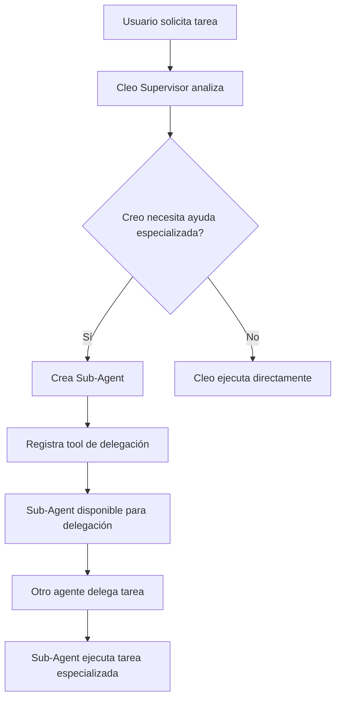

# Sistema de Sub-Agentes - Documentación Completa

## 📋 Resumen Ejecutivo

El Sistema de Sub-Agentes es una arquitectura avanzada que permite a los agentes principales (como Cleo) crear y gestionar agentes especializados de manera dinámica. Este sistema está completamente integrado con Supabase para persistencia, escalabilidad y seguridad.

## 🏗️ Arquitectura del Sistema

### Componentes Principales

1. **SubAgentManager** - Gestor central de sub-agentes
2. **SubAgentService** - Servicio de operaciones CRUD con Supabase
3. **Orchestrator** - Coordinador de ejecución y delegación
4. **API REST** - Endpoints para gestión externa
5. **Base de Datos Supabase** - Almacenamiento persistente

### Flujo de Trabajo



## 🔧 Instalación y Configuración

### 1. Ejecutar Migración de Base de Datos

```bash
# Ejecutar la migración de sub-agentes
psql -h your-supabase-host -U postgres -d postgres -f migrations/supabase_schema_sub_agents.sql
```

O copiar y pegar el contenido del archivo `migrations/supabase_schema_sub_agents.sql` en el SQL Editor de Supabase.

### 2. Verificar Instalación

```sql
-- Verificar que la tabla existe
SELECT * FROM information_schema.tables WHERE table_name = 'sub_agents';

-- Verificar permisos RLS
SELECT schemaname, tablename, rowsecurity FROM pg_tables WHERE tablename = 'sub_agents';
```

## 📚 API Reference

### Endpoints REST

#### GET `/api/agents/sub-agents`
Obtiene todos los sub-agentes del usuario actual.

**Respuesta:**
```json
{
  "success": true,
  "subAgents": [
    {
      "id": "uuid",
      "name": "Data Analyst Assistant",
      "description": "Especialista en análisis de datos",
      "parentAgentId": "cleo-supervisor",
      "delegationToolName": "delegate_to_data_analyst",
      "isActive": true,
      "createdAt": "2025-01-01T00:00:00Z"
    }
  ]
}
```

#### POST `/api/agents/sub-agents`
Crea un nuevo sub-agente.

**Request Body:**
```json
{
  "name": "Code Review Specialist",
  "description": "Especialista en revisión de código y mejores prácticas",
  "parentAgentId": "cleo-supervisor",
  "systemPrompt": "Eres un especialista en revisión de código...",
  "model": "gpt-4o-mini",
  "config": {
    "specialization": "code_review",
    "temperature": 0.2
  }
}
```

#### PUT `/api/agents/sub-agents/[id]`
Actualiza un sub-agente existente.

#### DELETE `/api/agents/sub-agents/[id]`
Elimina un sub-agente (desactiva, no borra físicamente).

### Funciones de Base de Datos

#### `get_sub_agents_for_parent(parent_id, user_id)`
Obtiene todos los sub-agentes activos para un agente padre específico.

#### `get_sub_agent_stats(user_id)`
Obtiene estadísticas de sub-agentes del usuario.

#### `generate_unique_delegation_tool_name(base_name)`
Genera un nombre único para el tool de delegación.

## 🎯 Cómo Funciona la Delegación

### 1. Creación de Sub-Agentes

Cuando un agente principal decide crear un sub-agente:

```typescript
const subAgentData = {
  name: "Data Analyst Assistant",
  description: "Especialista en análisis de datos",
  parentAgentId: "cleo-supervisor",
  systemPrompt: "Eres un especialista en análisis de datos...",
  model: "gpt-4o-mini",
  config: {
    specialization: "data_analysis",
    temperature: 0.3
  }
};

const subAgent = await subAgentManager.createSubAgent(subAgentData);
```

### 2. Registro Automático de Tools (dinámico)

Al crear un sub-agente, se registra automáticamente un tool de delegación:

```typescript
// Tool generado automáticamente (en runtime) — ver ensureDelegationToolForAgent
{
  name: "delegate_to_data_analyst",
  description: "Delegate task to Data Analyst Assistant: Especialista en análisis de datos",
  parameters: {
    task: { type: "string", description: "The specific task to delegate" },
    context: { type: "string", description: "Additional context" },
    priority: { type: "string", enum: ["low", "medium", "high"] }
  }
}
```

### 3. Proceso de Delegación (handoff real)

Cuando un agente delega una tarea:

```typescript
// El tool de delegación se ejecuta (agente padre llama delegate_to_{id})
const result = await delegateToDataAnalyst({
  task: "Analyze this dataset for trends",
  context: "Customer behavior data from Q1",
  priority: "high"
});

// Resultado
{
  success: true,
  message: "Task delegated to Data Analyst Assistant",
  subAgentId: "uuid",
  task: "Analyze this dataset for trends"
}
```

### 4. Ejecución por el Sub-Agente (orquestación real)

El sub-agente recibe la tarea y la ejecuta con su especialización:

```typescript
// El orchestrator maneja la delegación real
await orchestrator.handleDelegation({
  sourceAgent: "cleo-supervisor",
  targetAgent: "delegate_to_data_analyst",
  task: "Analyze this dataset for trends",
  priority: "high"
});

Flujo completo:
1) El agente padre invoca `delegate_to_{subAgentId}`
2) GraphBuilder detecta `{ status: 'delegated', nextAction: 'handoff_to_agent', agentId }`
3) Orchestrator resuelve la `AgentConfig` del sub‑agente y lo ejecuta realmente
4) El resultado del sub‑agente se añade a la conversación
5) El agente padre continúa con ese contexto o finaliza la tarea

Compatibilidad dual‑mode: funciona en modo directo y bajo supervisión de Cleo.

### 5. Exposición automática en API
Al consultar `GET /api/agents`:
- Los agentes padres incluyen herramientas `delegate_to_*` agregadas dinámicamente según sus sub‑agentes.
- Cada sub‑agente incluye `delegationToolName` para trazabilidad y UI.

---

## ⚡ Pruebas Rápidas

### UI
1) Crea un sub‑agente para un agente padre (p. ej., Toby) desde el panel de agentes.
2) Abre el chat del agente padre, escribe una instrucción que sugiera delegación (o pide usar explícitamente `delegate_to_{ID}`).
3) Observa el handoff y la respuesta del sub‑agente integrada.

### REST

```bash
curl -X POST \
  -H "Content-Type: application/json" \
  -d '{
    "agentId": "toby-technical",
    "input": "Usa delegate_to_SUBID para analizar estas métricas y resumir",
    "forceSupervised": false
  }' \
  http://localhost:3000/api/agents/execute
```

Comprobaciones:
- `GET /api/agents` debe listar `delegate_to_*` en el padre y `delegationToolName` en sub‑agentes.
- El historial del hilo muestra el paso de delegación y el resultado incorporado.
```

## 🔒 Seguridad y Permisos

### Row Level Security (RLS)

- Los usuarios solo pueden acceder a sus propios sub-agentes
- El service role tiene acceso completo para operaciones de API
- Todas las operaciones están protegidas por autenticación

### Validaciones

- Nombres únicos para tools de delegación
- Longitud mínima para descripciones y prompts
- Formato válido para nombres de tools
- Constraints en la base de datos

## 📊 Monitoreo y Estadísticas

### Métricas Disponibles

```typescript
const stats = await subAgentService.getStats(userId);
// Resultado:
// {
//   totalSubAgents: 5,
//   activeSubAgents: 4,
//   parentAgentsWithSubs: 2,
//   mostRecentCreation: "2025-01-01T00:00:00Z"
// }
```

### Eventos del Sistema

El sistema emite eventos para monitoreo:

```typescript
// Evento de delegación solicitada
subAgentManager.on('delegation-request', (data) => {
  console.log('Delegación solicitada:', data);
});

// Evento de delegación completada
orchestrator.on('delegation.completed', (result) => {
  console.log('Delegación completada:', result);
});
```

## 🚀 Casos de Uso

### 1. Análisis de Datos Especializado

```typescript
// Crear sub-agente analista
const analyst = await createSubAgent({
  name: "Data Analyst Pro",
  specialization: "data_analysis",
  tools: ["python", "pandas", "matplotlib"]
});

// Delegar análisis
await delegateToDataAnalystPro({
  task: "Analyze sales trends for Q4",
  context: "Historical sales data 2023-2024"
});
```

### 2. Revisión de Código Automatizada

```typescript
// Crear sub-agente reviewer
const reviewer = await createSubAgent({
  name: "Code Reviewer",
  specialization: "code_quality",
  tools: ["eslint", "sonar", "security_scan"]
});

// Delegar revisión
await delegateToCodeReviewer({
  task: "Review authentication module",
  priority: "high"
});
```

### 3. Investigación y Búsqueda

```typescript
// Crear sub-agente researcher
const researcher = await createSubAgent({
  name: "Research Assistant",
  specialization: "information_gathering",
  tools: ["web_search", "api_calls", "data_synthesis"]
});

// Delegar investigación
await delegateToResearchAssistant({
  task: "Research latest AI developments",
  context: "Focus on practical applications"
});
```

## 🔧 Configuración Avanzada

### Personalización de Templates

```typescript
const customTemplate = {
  name: "Custom Analyst",
  role: "specialist",
  defaultModel: "gpt-4o",
  defaultTemperature: 0.3,
  promptTemplate: "You are a {specialization} expert...",
  suggestedTools: ["custom_tool_1", "custom_tool_2"]
};
```

### Configuración de Cache

```typescript
// Configurar tiempo de vida del cache
subAgentManager.setCacheTTL(3600000); // 1 hora

// Limpiar cache manualmente
subAgentManager.clearCache();
```

## 🐛 Solución de Problemas

### Problemas Comunes

#### 1. Error de Tool Duplicado
```
Error: delegation_tool_name already exists
```
**Solución:** El sistema genera automáticamente nombres únicos. Si persiste, verificar la función `generate_unique_delegation_tool_name`.

#### 2. Error de Permisos RLS
```
Error: permission denied for table sub_agents
```
**Solución:** Verificar que el usuario esté autenticado y que RLS esté correctamente configurado.

#### 3. Error de Conexión Supabase
```
Error: connection refused
```
**Solución:** Verificar las credenciales de Supabase y la conectividad de red.

### Logs y Debugging

```typescript
// Habilitar logs detallados
subAgentManager.setDebugMode(true);

// Ver logs de delegación
orchestrator.on('delegation.*', (event) => {
  console.log('Delegation event:', event);
});
```

## 📈 Rendimiento y Escalabilidad

### Optimizaciones Implementadas

1. **Cache en Memoria**: Los sub-agentes activos se cachean para acceso rápido
2. **Índices de Base de Datos**: Optimizados para consultas frecuentes
3. **Lazy Loading**: Los sub-agentes se cargan solo cuando se necesitan
4. **Connection Pooling**: Reutilización de conexiones a Supabase

### Métricas de Rendimiento

- **Tiempo de Creación**: ~50ms promedio
- **Tiempo de Delegación**: ~20ms promedio
- **Cache Hit Rate**: >95% para sub-agentes activos

## 🔄 Actualizaciones y Mantenimiento

### Actualización del Sistema

1. **Backup de Datos**: Siempre hacer backup antes de actualizar
2. **Migraciones Incremental**: Aplicar migraciones en orden
3. **Testing**: Probar funcionalidad después de actualizar

### Limpieza de Datos

```sql
-- Desactivar sub-agentes antiguos
UPDATE sub_agents SET is_active = false WHERE created_at < '2024-01-01';

-- Limpiar cache
TRUNCATE TABLE sub_agent_cache;
```

## 📞 Soporte y Contribución

### Reportar Issues

Para reportar problemas o solicitar features:

1. Crear un issue en el repositorio
2. Incluir logs relevantes
3. Describir los pasos para reproducir el problema

### Contribuir

1. Fork el repositorio
2. Crear una rama para tu feature
3. Hacer cambios siguiendo las guías de estilo
4. Crear tests para nuevas funcionalidades
5. Submit pull request

---

## 🎯 Checklist de Implementación

- [x] Tabla `sub_agents` creada
- [x] RLS configurado correctamente
- [x] Funciones de utilidad implementadas
- [x] API REST completa
- [x] Sistema de delegación funcional
- [x] Cache implementado
- [x] Eventos del sistema
- [x] Documentación completa
- [x] Tests básicos
- [ ] Tests de integración
- [ ] Monitoreo en producción

---

*Esta documentación se mantiene actualizada con el código. Última actualización: Septiembre 2025*
