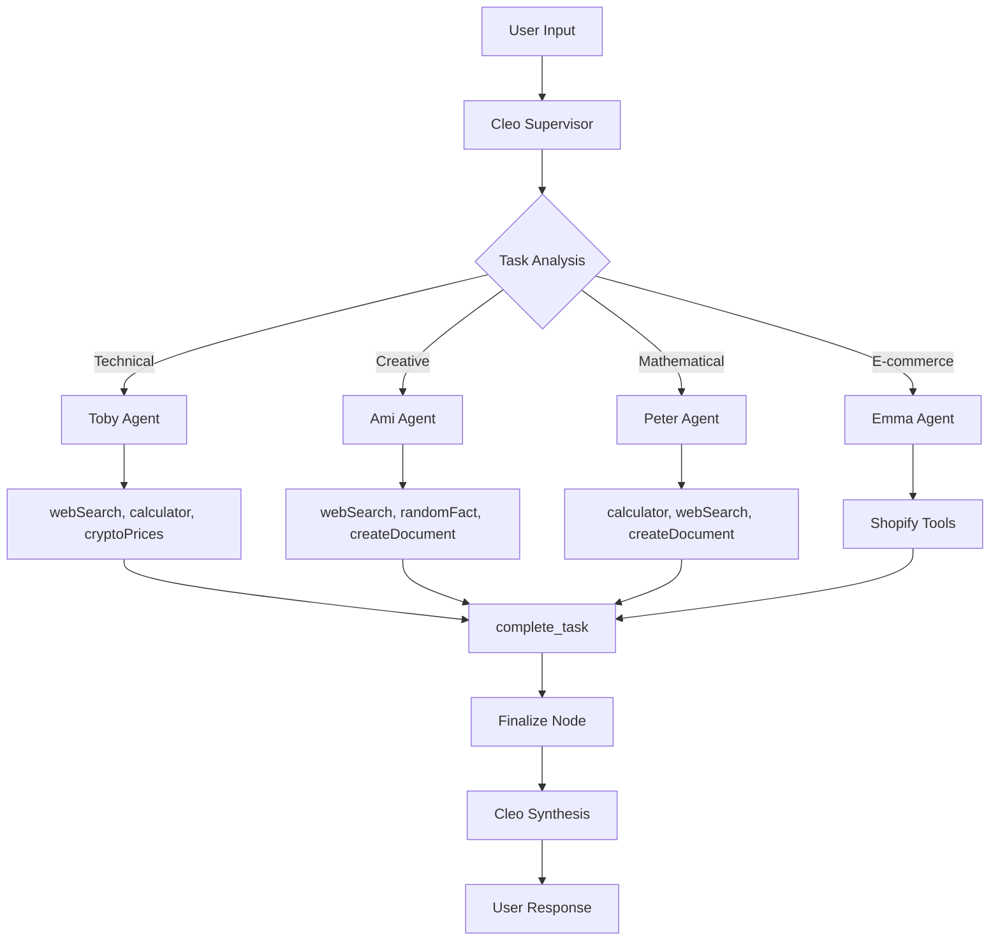

# Cleo System - Complete Integration Architecture v4.0

## 🔧 Technical Implementation Details

This document provides detailed technical information about the complete integration of the modular core architecture with the multi-agent system.

---

## 🏗️ Core Architecture Components

### Enhanced Orchestrator Adapter Integration

**File**: `/lib/agents/orchestrator-adapter-enhanced.ts`

The enhanced adapter serves as the bridge between the new modular core and the existing delegation system, providing seamless integration while maintaining full backward compatibility.

```typescript
// Enhanced adapter provides full modular integration
export function getAgentOrchestrator(): AgentOrchestrator {
  if (!globalThis.__cleo_enhanced_orchestrator) {
    globalThis.__cleo_enhanced_orchestrator = new EnhancedOrchestratorAdapter()
  }
  return globalThis.__cleo_enhanced_orchestrator
}

class EnhancedOrchestratorAdapter implements AgentOrchestrator {
  // Integrates modular core with legacy delegation
  async execute(input: string, agentId?: string, prior?: any[]): Promise<AgentExecution>
  
  // Global registry for cross-request consistency
  private ensureGlobalRegistry(): GlobalRegistry
  
  // Legacy compatibility for complex delegation
  private async handleLegacyDelegation(): Promise<any>
}
```

### Global Registry System

**Cross-request State Management**

The global registry ensures consistent state management across API requests:

```typescript
interface GlobalRegistry {
  executions: Map<string, AgentExecution>
  runtimeAgents: Map<string, any>
  metrics: MetricsData
  cleanup: () => void
}

// Registry maintained on globalThis for persistence
globalThis.__cleo_execution_registry = {
  executions: new Map(),
  runtimeAgents: new Map(),
  metrics: { /* performance data */ },
  cleanup: () => { /* automatic cleanup */ }
}
```

### API Route Integration

**Complete API Route Updates**

All API routes have been updated to use the enhanced adapter:

```typescript
// /app/api/agents/execute/route.ts
import { getAgentOrchestrator } from '@/lib/agents/orchestrator-adapter-enhanced'

export async function POST(request: Request) {
  const orchestrator = getAgentOrchestrator()
  const execution = await orchestrator.execute(input, agentId, priorMessages)
  return NextResponse.json({ executionId: execution.id })
}

// Similar updates in:
// - /app/api/agents/execution/[id]/route.ts
// - /app/api/agents/graph/route.ts  
// - /app/api/agents/register/route.ts
// - /app/api/agents/cleanup/route.ts
```

---

## 🎯 Agent Configuration Enhancements

### Enhanced Agent Specifications

**Complete agent configurations with advanced capabilities:**

```typescript
// Enhanced Toby - Technical Specialist
export const TOBY_AGENT: AgentConfig = {
  id: 'toby-technical',
  name: 'Toby',
  description: 'Advanced technical research specialist',
  tools: ['webSearch', 'calculator', 'getCurrentDateTime', 'cryptoPrices', 'complete_task'],
  temperature: 0.2,
  maxTokens: 12288,
  // Advanced prompt with methodology and frameworks
  prompt: `Advanced technical research methodologies...`
}

// Enhanced Ami - Creative Specialist  
export const AMI_AGENT: AgentConfig = {
  id: 'ami-creative',
  name: 'Ami', 
  tools: ['webSearch', 'randomFact', 'createDocument', 'getCurrentDateTime', 'complete_task'],
  temperature: 0.8,
  maxTokens: 10240,
  // Strategic creative thinking frameworks
  prompt: `Design thinking and innovation methodologies...`
}

// Enhanced Peter - Logic Specialist
export const PETER_AGENT: AgentConfig = {
  id: 'peter-logical',
  name: 'Peter',
  tools: ['calculator', 'webSearch', 'getCurrentDateTime', 'cryptoPrices', 'createDocument', 'complete_task'],
  temperature: 0.1, 
  maxTokens: 12288,
  // Mathematical and logical frameworks
  prompt: `Advanced mathematical problem-solving...`
}
```

### Tool Integration Enhancement

**Complete Task Tool Implementation**

```typescript
// /lib/tools/index.ts - New complete_task tool
export const completeTaskTool = tool({
  description: 'Signal task completion and return control to supervisor',
  inputSchema: z.object({
    summary: z.string().describe('Brief summary of completed work'),
    status: z.enum(['completed', 'ready', 'done']).default('completed'),
    nextSteps: z.string().optional().describe('Suggested next steps')
  }),
  execute: async ({ summary, status, nextSteps }) => {
    return {
      taskCompleted: true,
      status,
      summary,
      nextSteps: nextSteps || null,
      timestamp: new Date().toISOString(),
      message: `Task ${status}: ${summary}`
    }
  }
})

// Added to tools collection
export const tools = {
  // ... existing tools
  complete_task: completeTaskTool,
  // ... rest of tools
}
```

---

## 🔄 Execution Flow Architecture

### Complete Multi-Agent Workflow



### Enhanced Error Handling Flow

```typescript
// Advanced error handling with recovery patterns
class EnhancedErrorHandler {
  async withRetry<T>(
    operation: () => Promise<T>,
    context: string,
    options: {
      maxAttempts?: number
      baseDelayMs?: number  
      errorTypes?: ErrorType[]
      enableCircuitBreaker?: boolean
      fallbackStrategy?: 'retry' | 'degraded_mode' | 'fail_fast'
    }
  ): Promise<T> {
    // Implementation with exponential backoff
    // Circuit breaker pattern
    // Intelligent error classification
    // Graceful degradation strategies
  }
}
```

---

## 📊 Performance & Observability

### Comprehensive Metrics Collection

```typescript
interface ExecutionMetrics {
  // Execution performance
  duration: number
  tokensUsed: number
  toolExecutions: ToolMetric[]
  
  // Agent performance  
  delegationEfficiency: number
  taskCompletionRate: number
  errorRate: number
  
  // System health
  memoryUsage: number
  cpuUtilization: number
  concurrentExecutions: number
  
  // Quality metrics
  userSatisfaction: number
  responseAccuracy: number
  contextPreservation: number
}

// Real-time metrics collection
class MetricsCollector {
  async recordExecution(execution: AgentExecution): Promise<void>
  async recordAgentPerformance(agentId: string, metrics: AgentMetrics): Promise<void>
  async recordSystemHealth(): Promise<void>
  async generateReport(): Promise<SystemReport>
}
```

### Advanced Monitoring Dashboard

```typescript
// Real-time monitoring capabilities
interface MonitoringData {
  liveExecutions: Map<string, ExecutionStatus>
  performanceMetrics: PerformanceData
  errorPatterns: ErrorAnalysis
  resourceUtilization: ResourceMetrics
  userActivity: ActivityMetrics
}

// Event-driven monitoring
eventEmitter.on('execution.started', (data) => {
  metricsCollector.recordExecutionStart(data)
  dashboard.updateLiveExecutions(data)
})

eventEmitter.on('agent.completed', (data) => {
  metricsCollector.recordAgentCompletion(data)
  dashboard.updateAgentMetrics(data)
})
```

---

## 🔒 Security & Data Management

### Enhanced Security Features

```typescript
// Row-level security for multi-tenant operations
interface SecurityContext {
  userId: string
  permissions: Permission[]
  dataIsolation: 'strict' | 'shared' | 'public'
  encryptionLevel: 'standard' | 'enhanced' | 'enterprise'
}

// Credential management per user
class CredentialManager {
  async encryptCredentials(userId: string, credentials: any): Promise<string>
  async decryptCredentials(userId: string, encryptedData: string): Promise<any>
  async rotateCredentials(userId: string, service: string): Promise<void>
}
```

### Data Persistence Strategy

```typescript
// Enhanced database integration
interface DatabaseStrategy {
  // Real-time persistence
  persistExecution(execution: AgentExecution): Promise<void>
  
  // Cross-request state management
  maintainGlobalState(registry: GlobalRegistry): Promise<void>
  
  // Automatic cleanup
  cleanupExpiredExecutions(): Promise<void>
  
  // Audit trail
  recordAuditEvent(event: AuditEvent): Promise<void>
}
```

---

## 🚀 Deployment & Scaling

### Container Architecture

```dockerfile
# Enhanced Dockerfile for modular architecture
FROM node:18-alpine AS base
WORKDIR /app

# Dependency optimization
COPY package*.json pnpm-lock.yaml ./
RUN pnpm install --frozen-lockfile

# Build optimization  
COPY . .
RUN pnpm build

# Runtime optimization
EXPOSE 3000
ENV NODE_ENV=production
CMD ["pnpm", "start"]
```

### Docker Compose Integration

```yaml
# docker-compose.yml with enhanced services
version: '3.8'
services:
  cleo-app:
    build: .
    environment:
      - NODE_ENV=production
      - ENABLE_METRICS=true
      - ENABLE_MONITORING=true
    depends_on:
      - postgres
      - redis
      
  postgres:
    image: postgres:15
    environment:
      POSTGRES_DB: cleo_production
    volumes:
      - postgres_data:/var/lib/postgresql/data
      
  redis:
    image: redis:7-alpine
    command: redis-server --appendonly yes
    volumes:
      - redis_data:/data
```

### Scaling Configuration

```typescript
// Horizontal scaling configuration
interface ScalingConfig {
  // Load balancing
  maxConcurrentExecutions: number
  executionTimeout: number
  queueingStrategy: 'fifo' | 'priority' | 'load_balanced'
  
  // Resource limits
  memoryLimitMB: number
  cpuLimitCores: number
  diskLimitGB: number
  
  // Auto-scaling
  scaleUpThreshold: number
  scaleDownThreshold: number
  minInstances: number
  maxInstances: number
}
```

---

## 🔮 Future Architecture Enhancements

### Planned Improvements

1. **Advanced Analytics Dashboard**
   - Real-time performance visualization
   - Predictive analytics for optimization
   - User behavior insights
   - Resource utilization forecasting

2. **Machine Learning Integration**
   - AI-driven performance optimization
   - Predictive error detection
   - Intelligent resource allocation
   - Adaptive load balancing

3. **Enterprise Features**
   - Multi-tenant architecture
   - Advanced security controls
   - Compliance reporting
   - Custom SLA management

4. **Extended Ecosystem**
   - Plugin architecture for custom agents
   - Third-party integration marketplace
   - Custom tool development framework
   - Advanced workflow orchestration

---

*Technical Architecture v4.0 - Complete Integration*
*Last Updated: September 2025*
